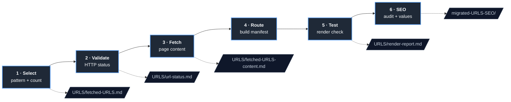
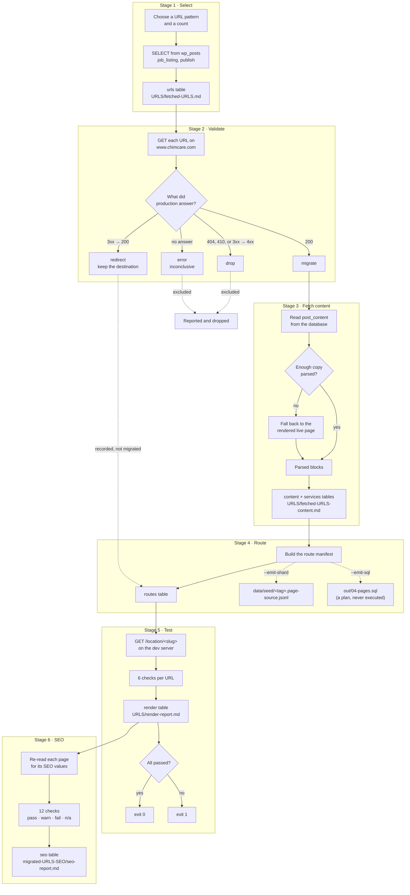
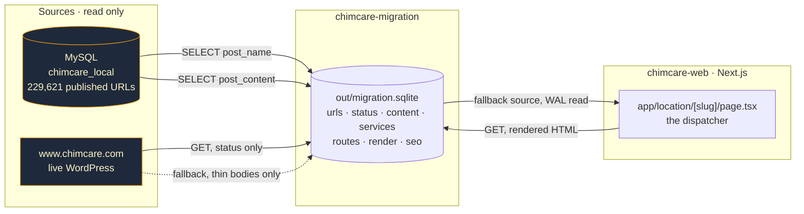
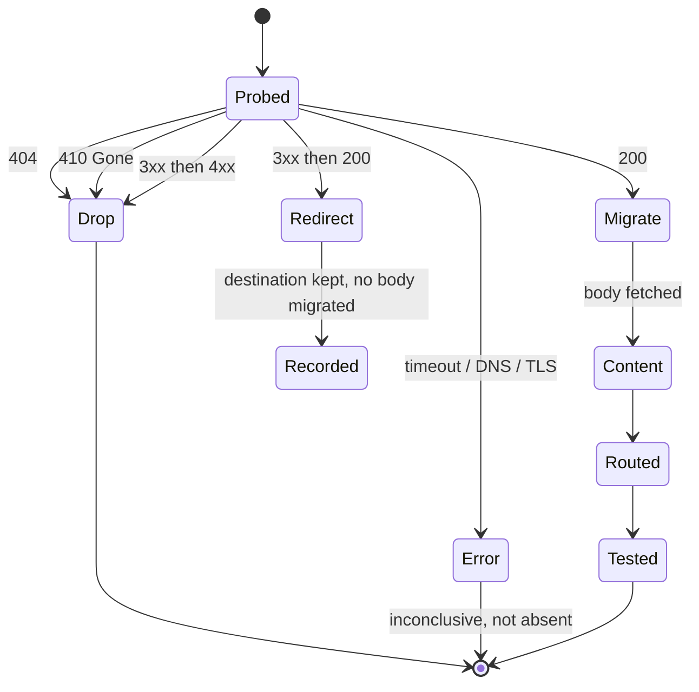
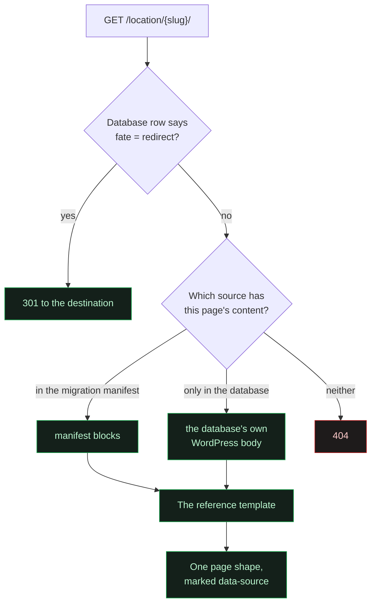
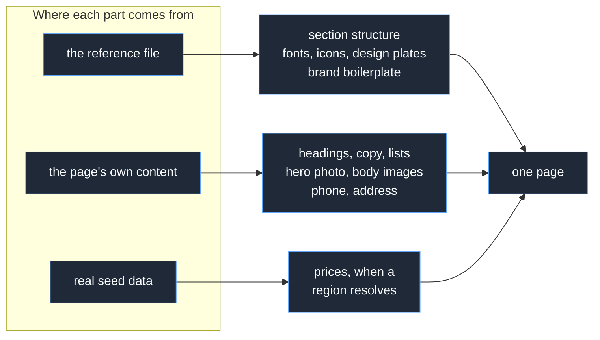

# Migration Trial and Error 1

A small, re-runnable pipeline that takes a handful of real WordPress URLs and proves they can be
rendered by the Next.js application. It is a rehearsal, not a cutover.

- **Status:** working pipeline, six stages, runnable end to end
- **Scope:** the local WordPress database (`chimcare_local`) and the Next.js app in `chimcare-web`
- **Out of scope:** Cloudflare, DNS, edge redirects, deployment, and anything that changes production
- **Writes to WordPress:** none, ever. Every database access in this pipeline is a `SELECT`

---

## 1. What the pipeline does



Each stage is a separate script that can be run on its own. Stages talk to each other through one
local database, `out/migration.sqlite` — one table per stage, `slug` as the primary key throughout —
never through the Markdown reports. The Markdown is for people; nothing parses it back. At 1,000 URLs
the old JSON chain reached 32 MB (`03-content.json`) and 15.1 MB (`04-routes.json`), which extrapolates
to 6.2 GB and 3.0 GB at 200,000, and the dispatcher was parsing the whole route file on every request
to find one slug. See `scripts/lib/store.py` for the full reasoning; `docs/pipeline-contract.md` has
the table-by-table contract. A JSON file is still written per stage for runs at or under 2,000 rows,
unchanged in shape, as a convenience — above that the database is the artifact.

---

## 2. The full flow



---

## 3. Where the data comes from and goes



**Nothing in this pipeline writes to WordPress, and nothing writes to the application database.**
The dispatcher opens `out/migration.sqlite` read-only and reads one row by slug when the application
database has nothing. WAL mode is what makes that safe while the pipeline is mid-run: a reader never
observes a half-committed transaction, so no temp-file-and-rename dance is needed the way the old
JSON files effectively required. A missing or unreadable database file falls back to database-only
behaviour, the same as an unknown slug — that is the whole integration.

---

## 4. The six stages

### Stage 1 · Select

Choose a URL pattern and how many URLs to take.

```bash
python3 scripts/stage1_select_urls.py --list-patterns
python3 scripts/stage1_select_urls.py --pattern 'chimney-sweep-%-wa' --limit 12 --run trial-1
```

The pattern is a SQL `LIKE` against `post_name`, so `%` is the wildcard. Selection is ordered by
post ID, never randomised, so the same pattern and count always return the same URLs. A trial you
cannot re-run identically cannot be compared against its own last run.

| Reads | Writes |
| --- | --- |
| `wp_posts` | `urls` table (+ `out/01-selected.json` at ≤2,000 rows), `URLS/fetched-URLS.md` |

### Stage 2 · Validate status

Ask production what each URL does today.

```bash
python3 scripts/stage2_validate_status.py --concurrency 4 --delay 0.2
```

Read-only `GET`, redirects followed one hop at a time so the chain is observed rather than inferred.
A 301 that lands on a 404 is a different fact from a clean 301, and only a hop-by-hop walk sees the
difference.

| Reads | Writes |
| --- | --- |
| `urls` table, live site | `status` table (+ `out/02-status.json` at ≤2,000 rows), `URLS/url-status.md` |

### Stage 3 · Fetch content

Pull the body of every URL that returned 200.

```bash
python3 scripts/stage3_fetch_content.py --min-words 80
```

The database first: it holds the body byte for byte, costs nothing to read and cannot rate-limit the
pipeline. The live page is a fallback used only when the stored body parses to less than
`--min-words` of copy, which is the plan's "if there is not enough data, search via browser".

Bodies are WPBakery shortcodes wrapping HTML, so the shortcode layer is stripped before the copy is
readable. Images are carried as blocks in their true reading position, and the page's WordPress
featured image is resolved separately for the hero. The raw bytes and their SHA-256 are kept next to
the parsed form, so a parsing mistake is recoverable without another database round trip.

Alt text is taken from the source or left empty. An empty alt is a real signal that an image is
decorative; an invented one is a lie about the page.

#### The service directory is built from URLs that exist

Each record also carries the services that city actually has a page for. The catalogue of 92 services
is read from the application's own `data/seed/services.ts`; the page's slug is split back into
`{service}-in-{city}-{state}`; and one query per city — not per page, and never per service — asks
WordPress which of the 92 `{key}-in-{city}-{state}` slugs exist as published `job_listing` rows. Only
those become links, so every card on a migrated page points at a page that is really there, and a
page never links to itself.

The spread is the reason this is resolved rather than assumed: coverage runs from 0 to 92 services
per city, median 24. In the 100-page run that is 3,488 matching published pages, of which 3,477
become links — the other 11 are pages linking to themselves, and are dropped. 18 of the 100 pages
have no service pages in their city at all, and show no directory rather than a grid of 404s.

| Reads | Writes |
| --- | --- |
| `status` table, `wp_posts`, `wp_postmeta`, `data/seed/services.ts`, live site | `content` + `services` tables (+ `out/03-content.json` at ≤2,000 rows), `URLS/fetched-URLS-content.md` |

### What the page renders, and what it only archives

A migrated body is a WordPress article: the first hundred pages carry a median of 87 blocks each. The
page renders the opening group — the body's first heading and the copy under it — and nothing after
it. The rest is archived in the pipeline's own output rather than shown.

That is an editorial decision, taken with the measurement in hand:

| | |
| --- | --- |
| Share of each body not rendered | median 93%, range 60% to 99% |
| Words not rendered, across 100 pages | 201,267 |
| Source words left on a page | median 110 |

The reasoning is that the rest duplicated what the design already says better. The source's own "why
choose us" section repeats the trust panel, and its long service list repeats the service directory,
which links to pages that actually exist rather than merely naming them.

**The consequence is worth stating plainly.** With most of the unique text gone, these hundred pages
are largely one template plus a catalogue. That is the classic shape of a duplicate-content problem in
search, and it is a trade the design chose, not a fact the pipeline discovered.

Stage 4 records the split on every route as `renderedBlocks` and `archivedWords`, and stage 5 scores
coverage against the rendered portion — otherwise a deliberate cut would read as a hundred broken
pages. Nothing is deleted: the full body, its raw bytes and its SHA-256 stay in the `content` table,
and `body` is only ever cleared by an explicit `prune()`.

### Stage 4 · Build routes

Turn the fetched content into something the application can serve.

```bash
python3 scripts/stage4_build_routes.py --tag trial-1 --emit-shard --emit-sql
```

This stage is non-destructive by design. It writes a manifest and, on request, two artifacts a real
cutover would need. It does not insert a single row anywhere.

| Reads | Writes |
| --- | --- |
| `content`, `services` tables | `routes` table (+ `out/04-routes.json` at ≤2,000 rows), optionally the source shard and a SQL plan |

### Stage 5 · Test render

Prove the content actually reaches the page.

```bash
npm run dev            # in chimcare-web, separate terminal
python3 scripts/stage5_test_render.py --coverage 0.8
```

Six checks per URL: the page returns 200, its first heading is present, the share of extracted copy
that appears in the rendered text clears the coverage threshold, no literal `{{` placeholder leaks
through, every image the manifest holds actually reaches the HTML, and a title exists.

A page whose content came from the database is scored differently: its `data-source` says the manifest
was never used, so coverage against the manifest is skipped rather than counted as a failure. Exits non-zero if any check fails, so
it works as a gate.

| Reads | Writes |
| --- | --- |
| `routes` table, the dev server | `render` table (+ `out/05-render.json` at ≤2,000 rows), `URLS/render-report.md` |

### Stage 6 · SEO audit

Record what the migrated pages say about themselves, and how that compares to the source.

```bash
python3 scripts/stage6_check_seo.py --min-words 80
```

Twelve checks over the rendered head and headings: title and description presence, length and
agreement with the stored Yoast values, canonical, a single `h1`, heading order, JSON-LD, image alt
text and word count. Each is `pass`, `warn`, `fail` or `n/a`, and the distinction matters: a page
whose WordPress source never had a meta description cannot fail to carry one over, so that is `n/a`
rather than a failure. Source coverage is reported separately, because it is the ceiling on what any
migration of these pages could achieve.

The audit also reports duplicate titles and descriptions across the set, which no per-page check can
see.

| Reads | Writes |
| --- | --- |
| `routes`, `content` tables, the dev server | `seo` table (+ `migrated-URLS-SEO/seo-values.json` at ≤2,000 rows), `migrated-URLS-SEO/seo-report.md` |

### All six at once

```bash
python3 scripts/run_pipeline.py --pattern 'chimney-sweep-%-wa' --limit 12 --run trial-1 --start-server
```

---

## 5. How a URL's fate is decided

The original sketch had one filter: drop the 404s. That is too coarse, because a URL has more than
two useful answers.



Collapsing redirects into "not a 404, so migrate it" would carry a body onto a URL that should
forward. Collapsing them into "not a 200, so drop it" would throw away the destination. Both are
recorded instead.

A 410 is dropped alongside a 404. The two say different things to a crawler — 410 means the page was
removed on purpose — but they say the same thing to this pipeline: there is nothing to migrate. The
reason recorded against each dropped URL keeps the distinction readable in the report.

---

## 6. How a URL reaches its page

Every `/location/{slug}/` page renders through **one template**, the client reference design, whatever
supplies its content. `app/location/[slug]/page.tsx` is the single dispatcher, and it chooses a
content source rather than a template.



The manifest wins when a slug is in both, because seeing the migration's own extraction rendered is
the point of the exercise.

Both sources are parsed into the same block stream — headings, paragraphs, list items and images in
true reading order — so the template never has to know where a page came from. The database adapter
parses the same WPBakery body the pipeline parses, through a TypeScript port of the pipeline's own
parser, which is what makes one template possible at all.

**What still differs between the two sources is data, not design.** A database-backed page resolves a
region, so its booking card carries real prices. A manifest page has no region row, so the same card
renders without them. Showing a price that had not been resolved would be inventing one.

Each page carries `data-source="manifest"` or `data-source="database"` so the pipeline's own checks
can tell which content was measured. Stage 5 uses it to skip manifest-coverage scoring on a page the
manifest never supplied.

Generating one route file per URL was never an option: 229,621 route files cannot build.

**What this does not do.** The pipeline still writes no rows to `site.pages`. Stage 4 emits those
inserts to `out/04-pages.sql` as a plan, and nothing executes it.

## 7. The page template

Every location page renders in the shape of the client reference at
`chimcare-web-2-RECOVERED/send-to-client/spokane.html`. That file is the agreed design, and it is also
where most of the SEO head comes from: title, description, canonical, Open Graph, Twitter card, geo
tags and a JSON-LD graph.

The structure follows the reference **exactly** — every section, in the reference's own order — and the
reference's own imagery and fonts are used, not approximated. The file embeds all of it: 10 web fonts
and 20 images as base64, plus 98 inline SVG icons. Those are extracted to real files under
`public/reference/` so the browser can cache them, and the stylesheet is rewritten to point at the
files instead of carrying 1.9 MB of data URIs inline.

The page renders these sections, in this order:

1. **Hero** — the city photograph, breadcrumbs, a trust line, the `h1`, a lede, call and booking
   buttons, a Google rating badge, then the address.
2. **Trust strip** — three tiles.
3. **Intro** — the page's own first body paragraph.
4. **The dark "why" band** — four tiles, rendered as markup with red icons.
5. **Service accordion** — the reference's eight standard services. No photographs.
6. **Solutions** — the service directory.
7. **Process steps · pricing.**
8. **Service area** — a two-row horizontal rail.
9. **FAQ** — the reference's seven questions.
10. **Closing panel.**

The contact section was removed. The FAQ took its place — see the fifth pass in
`docs/runs/2026-09-11-family-a-100.md` for how and why.



**Boilerplate is not invention, and per-city facts are not boilerplate.** The trust strip, the pricing
prose and the closing panel are the brand's own copy with the city, phone and branch address
substituted in, so they are carried. A figure, a star rating, a review count or an opening time is a
claim about a specific place: those appear only when the page's own data or the seed supplies them,
and the element is omitted otherwise. The pricing panel therefore shows its prose and its list of
factors on every page, but a price only where a region resolves.

**A page's own photograph always beats a reference plate.** The extracted imagery is design furniture
and fills the design's fixed positions. The hero photo and the body images that came out of WordPress
are that page's content, and they take precedence.

Both content sources feed the same template, so a visitor cannot tell which pages were migrated. See
section 6 for how a page's content source is chosen.

### What the design asserts and the data cannot

The reference makes a handful of claims that are not true of every page it is asked to render. Each
one is guarded rather than trusted, because a guard is the interesting part of porting a fixed design
onto variable data.

- **Two sentences from the accordion were dropped.** They claim a heating season and freezing
  winters — true of Spokane, false on the Arizona and Georgia pages in this run. A third,
  Spokane-only neighbourhood name became a city slot instead. Every drop is recorded in a
  `droppedSentences` audit field, so a page never silently loses a claim without a trace of why.

- **The FAQ question that quotes prices renders only where a real region price resolves,** and is
  omitted entirely otherwise rather than reworded around a missing number. Verified: a
  database-sourced page shows it; manifest pages do not, and no currency symbol appears anywhere in
  their visible text.

- **The Google rating is real — 4.7 from 377 reviews, read from `wp_postmeta` — but it is one
  company-wide value, not a rating of the page's location.** It renders as a visible badge and emits
  no `AggregateRating` structured data, for three reasons: the project forbids that markup; the
  reference contradicts itself (its own visible badge says 4.7 while its own JSON-LD declares 4.9
  with 17,472 ratings); and a company-wide figure is not a per-city rating regardless. This answers
  the project's open question Q5, which asked where the visible "Rated 4.7 on Google" line comes
  from.

- **Area chips come only from a page's own migrated list.** 77 of 100 pages have one (4 to 13 items,
  median 6); the other 23 render a "coverage coming soon" panel. No neighbourhood name is ever
  generated.

## 8. What changed from the original sketch

The sketch is sound. Seven things were tightened while building it.

| # | Sketch | What the pipeline does | Why |
| --- | --- | --- | --- |
| 1 | "Filter out 404" | Four fates: migrate, redirect, drop, error | A redirect destination is worth keeping; a broken chain is worse than a plain 404 and should be visible. 404 and 410 both drop |
| 2 | Markdown between the steps | JSON is the contract, Markdown is the report | Markdown is for reading. Parsing it back would make a formatting change a pipeline break |
| 3 | Create routing per URL | One dynamic trial route over a manifest | The app already works this way, and 229,621 route files cannot build |
| 4 | "Test if content is rendered properly" | Six named checks, non-zero exit on failure | "Properly" is not something a script can assert. Coverage ratio, heading presence and placeholder leakage are |
| 5 | Unstated ordering | Ordered by post ID, never random | Two runs of the same command must select the same URLs, or nothing can be compared |
| 6 | Fetch content, exclude images | Images counted, never carried; raw bytes and SHA-256 retained | The count makes the exclusion visible, and the hash makes a parser bug recoverable |
| 7 | Unbounded fetching | Bounded concurrency with a delay, one honest user agent | A few hundred URLs should not look like a burst of traffic to the origin |
| 8 | No SEO step | Stage 6 audits and records the SEO values | A page can render correctly and still carry nothing a search engine reads |
| 9 | No template named | Pages render in the client reference's shape | The design is already agreed, and it supplies the SEO head the audit found missing |
| 10 | Exclude images | Images are carried | Reversed after seeing the result: the reference layout is built around its imagery, and without it the pages render as a skeleton with holes |
| 11 | Two templates, one per source | One template for every location URL | A visitor should not be able to tell which pages were migrated; the difference between sources belongs in the data, not the design |
| 12 | A subset of the reference's sections | The reference's exact structure, with its own fonts and imagery | Rendering four of its eleven sections left the design looking unfinished; the omitted sections turned out to be brand boilerplate, not per-city claims |

Two checks in stage 5 exist because of known defects in this codebase, not because of the sketch:
unfilled `{{slot}}` placeholders have reached rendered pages before, and excluded images have a way
of coming back through a template. Both are now assertions rather than assumptions.

---

## 9. Limits of this trial

- **Twelve URLs is not a sample.** The first run covers `chimney-sweep-%-wa`, which is 992 of
  229,621 published URLs. Nothing here supports a claim about the whole site.
- **Stage 2 reads the live site.** It is a read-only `GET` with a delay between requests, but it is
  still traffic to production. Nothing is written and no infrastructure is touched.
- **Coverage is a containment ratio, not a judgement of quality.** A page can clear 0.8 coverage and
  still read badly. A human still has to look at the rendered result. This was proved in practice:
  every page passed every render check while still looking sparse, because no automated check can see
  an empty band.
- **Images are hotlinked from the WordPress host.** Carrying them makes the pages look right, but
  moving the assets is a separate decision this trial has not made.
- **The extraction is not the migration.** Stage 4 stops at a manifest and a SQL plan on purpose.
  Applying either one is a separate decision that this trial does not make.

---

## 10. Files

```
chimcare-migration/
├── docs/
│   ├── migration-trial-and-error-1.md   this plan
│   ├── URL-patterns.md                  every URL shape in the database, regenerable
│   └── pipeline-contract.md             the table each stage reads and writes
├── scripts/
│   ├── lib/
│   │   ├── paths.py        every path, resolved once
│   │   ├── wp.py           read-only MySQL through the mysql client
│   │   ├── http.py         polite bounded fetching, hop-by-hop redirects
│   │   ├── content.py      WPBakery shortcode stripping
│   │   └── report.py       Markdown writers
│   ├── stage1_select_urls.py
│   ├── stage2_validate_status.py
│   ├── stage3_fetch_content.py
│   ├── stage4_build_routes.py
│   ├── stage5_test_render.py
│   ├── stage6_check_seo.py   writes migrated-URLS-SEO/
│   ├── extract_reference_template.py  pulls the CSS and shape from the reference
│   ├── list_url_patterns.py  writes docs/URL-patterns.md
│   └── run_pipeline.py       stages 1-5 in order
├── URLS/                   the human-readable reports
├── migrated-URLS-SEO/      the SEO values and audit
└── out/                    migration.sqlite — the database contract between stages
                            (plus a JSON file per stage for runs at or under 2,000 rows)
```

In the application:

```
chimcare-web/
├── app/location/
│   ├── [slug]/page.tsx        the dispatcher and the one template
│   ├── template.css           the reference stylesheet, pointing at real asset files
│   ├── template-assets.json   every image and font extracted, and where it belongs
│   ├── template-shape.json    what the reference contains, so the port is checkable
│   └── reference.css          the few overrides the migrated content still needs
├── lib/content/wp-blocks.ts   the WordPress body parser, a port of the pipeline's own
└── public/reference/          the fonts and imagery lifted out of the reference file
```

The fallback opens `out/migration.sqlite` read-only at request time and imports nothing from `lib/content` or
`lib/data`. Deleting that file returns the dispatcher to database-only behaviour.
