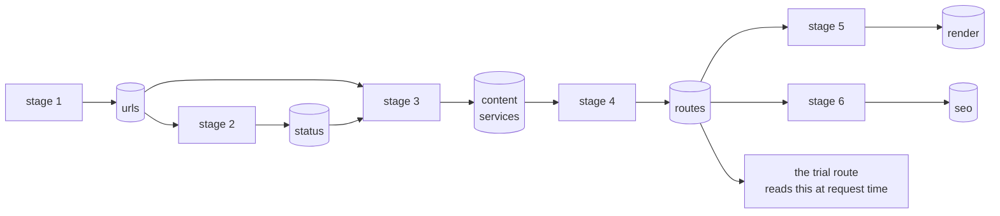

# Pipeline contract

What each stage reads and writes. Stages communicate through one local database,
`out/migration.sqlite` — one table per stage, `slug` as the primary key throughout. The Markdown in
`URLS/` is a report and is never parsed back.



Why a database and not a chain of JSON files: at 1,000 URLs the content artifact was 32 MB and the
route manifest 15.1 MB, which extrapolates to 320 MB / 151 MB at 10,000 and 6.2 GB / 3.0 GB at
200,000. The Next.js dispatcher was parsing that whole manifest on every request to find one slug —
a migration manifest treated like a database while read like a text file. SQLite gives an indexed
`SELECT ... WHERE slug = ?`, one row read instead of a whole-file parse, and it ships in both
Python's and Node's standard library, so neither side gains a dependency. The full reasoning,
including why the store is local rather than hosted, lives in the docstring of
`scripts/lib/store.py` — read that first if this file raises a question it doesn't answer.

**JSON artifacts still exist for small runs.** At or under 2,000 rows, each stage also writes the
JSON file named in this document, unchanged in shape, as a convenience for reading a run by hand or
diffing two runs. Above 2,000 rows the database is the artifact and the JSON file is not written.
Every table row carries `run_id` (or a `meta` key namespaced by stage) so a row is never ambiguous
about which run produced it, the way `stage`/`runId`/`generatedAt` did for the JSON files.

**WAL mode, not temp-file-and-rename.** The pipeline writes while the dev server reads. In WAL a
reader sees the last committed state and never a partial one — that removes the torn-read problem at
the source instead of asking every reader to recover from it, which is what the old JSON files
needed a write-then-rename dance to approximate.

**Resumable stages.** `todo(source, done)` returns the slugs present in one stage's table and
missing from the next, so a stage takes its work from the previous stage's rows minus its own. A run
that dies at 9,000 of 10,000 does not re-request those 9,000. Stages 2, 3, 5 and 6 all use it —
exactly the stages that make network or database calls; stages 1 and 4 don't need it.

**Bodies stored once.** The raw WordPress body lives zlib-compressed in `content.body` and nowhere
else. `routes.payload` carries the blocks the page renders, not the original body — stage 4 does not
copy it. `prune()` drops `content.body` once a run is done, since it is the bulk of the database and
re-running stage 3 restores it.

**A corrupt or missing artifact is not a broken site.** The dispatcher opens the database read-only;
if the file is missing or unreadable it falls back to database-only behaviour, and an unknown slug
404s the same way it would if the database had never existed. Deleting `out/migration.sqlite`
restores that behaviour outright.

---

## Table `urls` (stage 1)

| Column | Notes |
| --- | --- |
| `slug` | primary key |
| `url` | where WordPress serves it |
| `wp_post_id`, `title`, `modified`, `content_length` | |
| `run_id` | which run selected this row |

```bash
python3 scripts/stage1_select_urls.py --list-patterns
python3 scripts/stage1_select_urls.py --pattern 'chimney-sweep-%-wa' --limit 12 --run trial-1
```

The pattern is a SQL `LIKE` against `post_name`, so `%` is the wildcard. Selection is ordered by
post ID, never randomised, so the same pattern and count always return the same URLs. A trial you
cannot re-run identically cannot be compared against its own last run.

| Reads | Writes |
| --- | --- |
| `wp_posts` | `urls` table (+ `out/01-selected.json` at ≤2,000 rows), `URLS/fetched-URLS.md` |

## Table `status` (stage 2)

| Column | Notes |
| --- | --- |
| `slug` | primary key |
| `first_status`, `final_status` | differ on every redirect |
| `final_url`, `hops` | the chain, walked hop by hop, not inferred |
| `fate` | `migrate` \| `redirect` \| `drop` \| `error`, indexed |
| `reason`, `redirect_to`, `error`, `probed_at` | |

```bash
python3 scripts/stage2_validate_status.py --concurrency 4 --delay 0.2
```

Read-only `GET`, redirects followed one hop at a time so the chain is observed rather than inferred.
A 301 that lands on a 404 is a different fact from a clean 301, and only a hop-by-hop walk sees the
difference.

| Reads | Writes |
| --- | --- |
| `urls`, live site | `status` table (+ `out/02-status.json` at ≤2,000 rows), `URLS/url-status.md` |

## Tables `content` and `services` (stage 3)

`content` — one row per slug that reached stage 3 with a fate of `migrate`:

| Column | Notes |
| --- | --- |
| `slug` | primary key |
| `post_title`, `post_modified` | |
| `yoast_title`, `yoast_metadesc`, `yoast_canonical` | |
| `phone`, `job_location` | |
| `thumbnail_id`, `hero_image` | the featured image, resolved separately from body images |
| `raw_sha256`, `raw_bytes` | of `body` exactly as stored, so a parsing mistake is recoverable |
| `body` | the WordPress source, zlib-compressed, stored **exactly once** in the pipeline |
| `parsed` | the block stream, zlib-compressed JSON: `blocks`, `h1`, `firstHeading`, counts, `words`, `plainText` |
| `words`, `image_count`, `content_source` | `content_source` is `database` or `live-page` |
| `fetched_at` | |

`services` — one row per real service link that city has:

| Column | Notes |
| --- | --- |
| `slug`, `key` | composite primary key |
| `category_key`, `service_slug`, `url` | |

```bash
python3 scripts/stage3_fetch_content.py --min-words 80
```

The database first: it holds the body byte for byte, costs nothing to read and cannot rate-limit the
pipeline. The live page is a fallback used only when the stored body parses to less than
`--min-words` of copy, which is the plan's "if there is not enough data, search via browser".

Bodies are WPBakery shortcodes wrapping HTML, so the shortcode layer is stripped before the copy is
readable. Images are carried as blocks in their true reading position, and the page's WordPress
featured image is resolved separately for the hero. `raw_sha256` and `raw_bytes` sit next to
`parsed` for the same reason `body` is kept at all: a parsing mistake is recoverable by re-parsing
`body`, never by re-fetching.

Alt text is taken from the source or left empty. An empty alt is a real signal that an image is
decorative; an invented one is a lie about the page.

#### The service directory is built from URLs that exist

Each `content` row's service directory lives in `services`, one row per link. The catalogue of 92
services is read from the application's own `data/seed/services.ts`; the page's slug is split back
into `{service}-in-{city}-{state}`; and one query per city — not per page, and never per service —
asks WordPress which of the 92 `{key}-in-{city}-{state}` slugs exist as published `job_listing` rows.
Only those become rows in `services`, so every card on a migrated page points at a page that is
really there, and a page never links to itself.

The spread is the reason this is resolved rather than assumed: coverage runs from 0 to 92 services
per city, median 24. In the 100-page run that is 3,488 matching published pages, of which 3,477
become links — the other 11 are pages linking to themselves, and are dropped. 18 of the 100 pages
have no service pages in their city at all, and show no directory rather than a grid of 404s.

| Reads | Writes |
| --- | --- |
| `status`, `wp_posts`, `wp_postmeta`, `data/seed/services.ts`, live site | `content`, `services` tables (+ `out/03-content.json` at ≤2,000 rows), `URLS/fetched-URLS-content.md` |

### What the page renders, and what it only archives

A migrated body is a WordPress article: the first hundred pages carry a median of 87 blocks each. The
page renders the opening group — the body's first heading and the copy under it — and nothing after
it. The rest stays in `content.parsed` and in `routes.payload`, archived rather than shown.

That is an editorial decision, taken with the measurement in hand:

| | |
| --- | --- |
| Share of each body not rendered | median 93%, range 60% to 99% |
| Words not rendered, across 100 pages | 201,267 |
| Source words left on a page | median 110 |

The reasoning is that the rest duplicated what the design already says better. The source's own "why
choose us" section repeats the trust panel, and its long service list repeats the service directory,
which links to pages that actually exist rather than merely naming them.

**The consequence is worth stating plainly.** With most of the unique text gone, these hundred pages
are largely one template plus a catalogue. That is the classic shape of a duplicate-content problem in
search, and it is a trade the design chose, not a fact the pipeline discovered.

Stage 4 records the split on every route as `rendered_blocks` and `archived_words`, and stage 5 scores
coverage against the rendered portion — otherwise a deliberate cut would read as a hundred broken
pages. Nothing is deleted: the full body, its raw bytes and its SHA-256 stay in `content`, and
`body` is only ever cleared by an explicit `prune()`.

## Table `routes` (stage 4)

| Column | Notes |
| --- | --- |
| `slug` | primary key |
| `url` | where WordPress serves it |
| `payload` | zlib-compressed JSON: title, SEO fields, hero image, `services`, `blocks`, and the counts below |
| `rendered_blocks` | how many blocks the page actually shows |
| `archived_words` | words in the blocks the page does not show, still inside `payload` |
| `service_count` | |
| `built_at` | |

```bash
python3 scripts/stage4_build_routes.py --tag trial-1 --emit-shard --emit-sql
```

This stage is non-destructive by design. It writes rows and, on request, two artifacts a real
cutover would need. It does not insert a single row anywhere outside its own table.

`services` and `service_count` are stage 3's, carried into `payload` verbatim — stage 4 resolves
nothing itself. They are links to pages WordPress really publishes, so a template can render the
directory without checking anything, and a city with `service_count: 0` renders no directory at all
rather than a grid of dead links.

`payload` carries the whole body — every block stage 3 parsed — but the page renders only the part
up to the rendered-cut rule, and `rendered_blocks` / `archived_words` record where that cut fell for
each route. Stage 5 scores `content_coverage` against the rendered portion for that reason: it is
checking that what the page shows matches what the page meant to show, not that the whole body
reached the page.

`routes` is the only table the application reads at request time. A URL that could not be routed is
recorded with its reason in the run's skip log rather than silently absent.

| Reads | Writes |
| --- | --- |
| `content`, `services` | `routes` table (+ `out/04-routes.json` at ≤2,000 rows), optionally the source shard and a SQL plan |

## Table `render` (stage 5)

| Column | Notes |
| --- | --- |
| `slug` | primary key |
| `status`, `served_from` | `served_from` is `manifest` or `database`, read from the page's `data-source` attribute |
| `coverage` | |
| `passed` | boolean, indexed |
| `checks` | zlib-compressed JSON, one entry per check |
| `checked_at` | |

```bash
npm run dev            # in chimcare-web, separate terminal
python3 scripts/stage5_test_render.py --coverage 0.8
```

Six checks per URL: the page returns 200, its first heading is present, the share of extracted copy
that appears in the rendered text clears the coverage threshold, no literal `{{` placeholder leaks
through, every image the manifest holds actually reaches the HTML, and a title exists.

A page whose content came from the database is scored differently: its `data-source` says the
manifest was never used, so coverage against the manifest is skipped rather than counted as a
failure. Exits non-zero if any check fails, so it works as a gate.

| Reads | Writes |
| --- | --- |
| `routes`, the dev server | `render` table (+ `out/05-render.json` at ≤2,000 rows), `URLS/render-report.md` |

## Table `seo` (stage 6)

| Column | Notes |
| --- | --- |
| `slug` | primary key |
| `extracted` | zlib-compressed JSON of the values read off the rendered head |
| `checks` | zlib-compressed JSON, one entry per check, each `pass` \| `warn` \| `fail` \| `n/a` |
| `failures` | count, for a quick filter |
| `checked_at` | |

```bash
python3 scripts/stage6_check_seo.py --min-words 80
```

Twelve checks over the rendered head and headings: title and description presence, length and
agreement with the stored Yoast values, canonical, a single `h1`, heading order, JSON-LD, image alt
text and word count. Each is `pass`, `warn`, `fail` or `n/a`, and the distinction matters: a page
whose WordPress source never had a meta description cannot fail to carry one over, so that is `n/a`
rather than a failure. Source coverage is reported separately, because it is the ceiling on what any
migration of these pages could achieve.

The audit also reports duplicate titles and descriptions across the set, which no per-page check can
see.

| Reads | Writes |
| --- | --- |
| `routes`, `content`, the dev server | `seo` table (+ `migrated-URLS-SEO/seo-values.json` at ≤2,000 rows), `migrated-URLS-SEO/seo-report.md` |

### All six at once

```bash
python3 scripts/run_pipeline.py --pattern 'chimney-sweep-%-wa' --limit 12 --run trial-1 --start-server
```

---

## Table `meta`

| Column | Notes |
| --- | --- |
| `key` | primary key, namespaced `"{stage}.{name}"` |
| `value` | JSON |

Where the JSON files carried `stage`, `runId`, `generatedAt` and per-run counters at the top of the
document, the database carries the same facts as `meta` rows namespaced by stage, read and written
through `set_meta` / `get_meta`. Several stages share the one table without colliding because the key
carries the stage name.

---

## Optional artifacts

`out/04-pages.sql` — `INSERT ... ON CONFLICT DO NOTHING` for `site.pages`. **A plan. The pipeline
never executes it.**

`data/seed/<tag>.page-source.jsonl` — one JSON object per line in the shape
`lib/data/page-source.ts` expects, written only with `--emit-shard`. This is the artifact a real
cutover would need; writing it does not perform one.

`out/migration.sqlite-wal`, `out/migration.sqlite-shm` — SQLite's WAL side files. They exist
whenever the database is open and are normal; they disappear on a clean checkpoint/close, and are
not part of the contract themselves.
