# Page Anatomies — chimcare-web

Every route in the canonical tree, every template behind it, and every section inside each template.
Derived by reading the source on 2026-09-11, not from the design mocks or the docs.

Tree: `~/Desktop/chimcare/codebase/chimcare-web`

---

## 1. The route universe

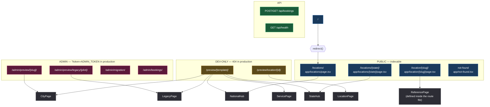

Seven distinct page templates exist. Only three of them are reachable by the public.
`CityPage`, `ServicePage`, `LegacyPage` and `LocationPage` survive **only** behind preview routes.

---

## 2. The global shell — wraps every route

`app/layout.tsx` renders the same chrome around every single page, including admin tables and the 404.

```
┌───────────────────────────────────────────────────────────────────────┐
│ <a class="skip">Skip to content</a>            ← first focusable       │
├───────────────────────────────────────────────────────────────────────┤
│ <Sprite/>  inline SVG symbol sheet (icons referenced by <use>)         │
├───────────────────────────────────────────────────────────────────────┤
│ HEADER  .hdr                                                          │
│ ┌───────┬────────┬──────────────────────┬──────┬──────┬─────────────┐ │
│ │ ☰menu │ logo   │ nav + phone (panel)  │ BBB  │ tel  │ Fast Online │ │
│ │       │202×62  │ Home Services        │ 34px │ link │ Booking btn │ │
│ │       │        │ Locations About      │      │      │             │ │
│ └───────┴────────┴──────────────────────┴──────┴──────┴─────────────┘ │
├───────────────────────────────────────────────────────────────────────┤
│ {children}  ← the route's own <main id="main"> + its dialogs          │
├───────────────────────────────────────────────────────────────────────┤
│ FOOTER  .ftr                                                          │
│ ┌──────────┬────────────┬───────────────┬────────────────┐            │
│ │ brand +  │ Services   │ States served │ Contact        │            │
│ │ logo chip│ ×10 (all   │ (verified →   │ tel, mail,     │            │
│ │ + blurb  │  → #booking│  /locations/x │ HQ address,    │            │
│ │          │  data-book)│  else #states)│ FB/YT/LinkedIn │            │
│ └──────────┴────────────┴───────────────┴────────────────┘            │
│ .ftr-legal  © year · Since 1989 · OR CCB #195475 · WA CHIMC**882C     │
│             Privacy · Terms · Cookie · Accessibility · DNSMI · Sitemap │
├───────────────────────────────────────────────────────────────────────┤
│ STICKY BAR .sfoot  (mobile only, CSS-hidden ≥ desktop)                │
│   [ ☎ Call Now ]  [ 📅 Book Online  data-book-sheet ]                  │
├───────────────────────────────────────────────────────────────────────┤
│ <Reveal/>  IntersectionObserver that adds .is-in to every .reveal      │
└───────────────────────────────────────────────────────────────────────┘
```

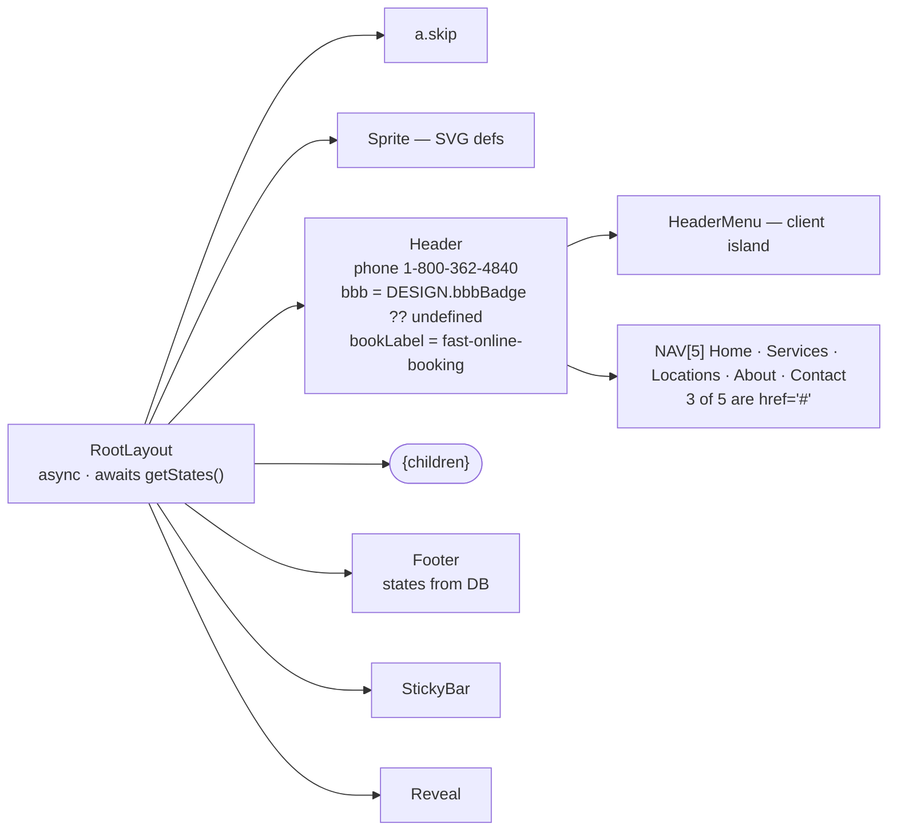

**Header conditional rules**

| Element | Condition | Note |
|---|---|---|
| `img.hdr-bbb` | only if `bbb` prop supplied | badge asserted only when the real asset exists |
| `img.hdr-bbb-panel` | same, mobile copy inside the menu panel | sized 34×34, never `hidden` (reset would pin it off) |
| `.hdr-book` "Fast Online Booking" | `bookLabel === 'fast-online-booking'` | else "Schedule Service" |
| `a.hdr-call` icon-only | always in DOM, CSS-gated to narrow | |

---

## 3. Template 1 — `NationalHub` → `/locations/`

`components/templates/NationalHub.tsx` · styles `hub.css` · props from `assembleNationalHub()`

```
╔═══════════════════════════════════════════════════════════════════════╗
║ 1  HERO  .hero                                         [JsonLd first] ║
║    crumbs: Home / Locations                                           ║
║    h1  "Find the ⟨Chimcare⟩ crew that works your street."             ║
║    lede "…across {n} states."                                         ║
║    ┌ NationalFinder island — search field filters BOTH directories ┐  ║
║    ctas: [Find Your Location →] [Schedule Service ·data-book]         ║
║    .hero-meta   {states} States │ {cities} Cities │ 1989 Since        ║
║    .hero-certs  MEMBERSHIPS & AWARDS + awards.png 1248×450            ║
╠═══════════════════════════════════════════════════════════════════════╣
║ 2  TRUST STRIP  <TrustStrip className="trust" awards={false}>         ║
║    3 × { icon, title, small }  from p.trust                           ║
╠═══════════════════════════════════════════════════════════════════════╣
║ 3  INTRO  .section.intro   two columns                                ║
║    ┌ rail (.reveal) ──────────┬ copy (.reveal) ───────────────────┐   ║
║    │ eyebrow "Who we are"     │ 2 hardcoded paragraphs           │   ║
║    │ h2 "Chimcare Service…"   │ ul.stats × 4 (sweep, repair,      │   ║
║    │ [Browse by state][Sched] │  waterproofing, gas)              │   ║
╠═══════════════════════════════════════════════════════════════════════╣
║ 4  STATES  .section.tinted #states                                    ║
║    SectionHead: "Where we work" / "{n} states, one standard of work." ║
║    ┌ StateDirectory island ────────────────────────────────────────┐  ║
║    │ .states #state-cards   article.state-card × N                 │  ║
║    │   photo OR .ph-plain placeholder · .abbr code · name · blurb  │  ║
║    │   first 4 city chips + "+N more"                              │  ║
║    │ #states-load-more (BATCH)   ·  .dir-coverage note             │  ║
║    │ .dirlist  multi-accordion, one .chips-head per group,         │  ║
║    │           city chips inside; .dir-empty when 0 hits           │  ║
╠═══════════════════════════════════════════════════════════════════════╣
║ 5  WHY  .section #why                                                 ║
║    SectionHead + .feats × 4 (FEATS const, numbered 01–04)             ║
╠═══════════════════════════════════════════════════════════════════════╣
║ 6  CREW  .section.tight #crew                                         ║
║    SectionHead + .crew-card × N   img 600×400 + info{title,small}     ║
╠═══════════════════════════════════════════════════════════════════════╣
║ 7  FINAL CTA  .section.final  .panel (dark)                           ║
║    copy ┆ side: [Find My Location][Schedule Service] a.phone-big      ║
╚═══════════════════════════════════════════════════════════════════════╝
   siblings of <main>:  <BookingSheet>  <FloatingCta quoteHref="#booking">
```

**Hardcoded vs. data**

| Section | Source |
|---|---|
| hero counts, finder groups, state cards | database (`getStates`, `getCitiesForState`, `getBranchesForState`) |
| trust strip, crew | assembler props |
| `FEATS` ×4, intro paragraphs, `ul.stats` ×4, all headings | **literal in the component** |

---

## 4. Template 2 — `StateHub` → `/locations/[state]/`

`components/templates/StateHub.tsx` · styles `state.css` · `assembleStateHub()`
Gate: `state.verified` must be true, else `notFound()`.

```
╔═══════════════════════════════════════════════════════════════════════╗
║ 1  HERO   style --img-state = url(p.imgState)                         ║
║    crumbs (from props) · h1 "⟨Chimcare⟩ Locations in {state}"         ║
║    lede (props) · HeroSearch island (GET form → /locations/{slug}/)   ║
║    ctas [Find Your Location →][Schedule Service]                      ║
║    .hero-meta  {count} Locations │ 1989 │ CSIA                        ║
║    .hero-certs awards.png                                             ║
╠═══════════════════════════════════════════════════════════════════════╣
║ 2  TRUST STRIP  awards={false}                                        ║
╠═══════════════════════════════════════════════════════════════════════╣
║ 3  DIRECTORY + MAP  .section.mapsec.dir-lead #directory               ║
║    SectionHead (eyebrow/heading/lede all from props)                  ║
║    ┌ LocationDirectory island — FIRST=6, STEP=12, all cards in HTML ┐ ║
║    └ MapPanel island — Leaflet NOT installed; renders the degraded   ┘ ║
║      list the mock specifies: every city + tel, behind a Show map     ║
╠═══════════════════════════════════════════════════════════════════════╣
║ 4  EDITORIAL INTRO  .section.tinted.intro                             ║
║    rail: eyebrow/h2/[Schedule][Read the detail] ┆ copy: p× + ul.stats ║
╠═══════════════════════════════════════════════════════════════════════╣
║ 5  EDITORIAL BLOCKS  article.ed (.flip alternating) × N               ║
║    figure .ph > img  ┆  eyebrow, h2, intro, ul.clist ✓bullets, outro  ║
╠═══════════════════════════════════════════════════════════════════════╣
║ 6  EXPANDABLE DETAIL  .section.tinted #services                       ║
║    SectionHead left · Accordion mode="multi" · item 0 is-open         ║
║    each panel: intro p, ✓bullets, paragraphs                          ║
╠═══════════════════════════════════════════════════════════════════════╣
║ 7  CREW  .section.crew — same card shape as NationalHub, .body not .info ║
╠═══════════════════════════════════════════════════════════════════════╣
║ 8  FINAL CTA  .panel — [Schedule Service][All Chimcare locations] tel ║
╚═══════════════════════════════════════════════════════════════════════╝
   siblings:  <BookingSheet>   <FloatingCta quoteHref="#directory">
```

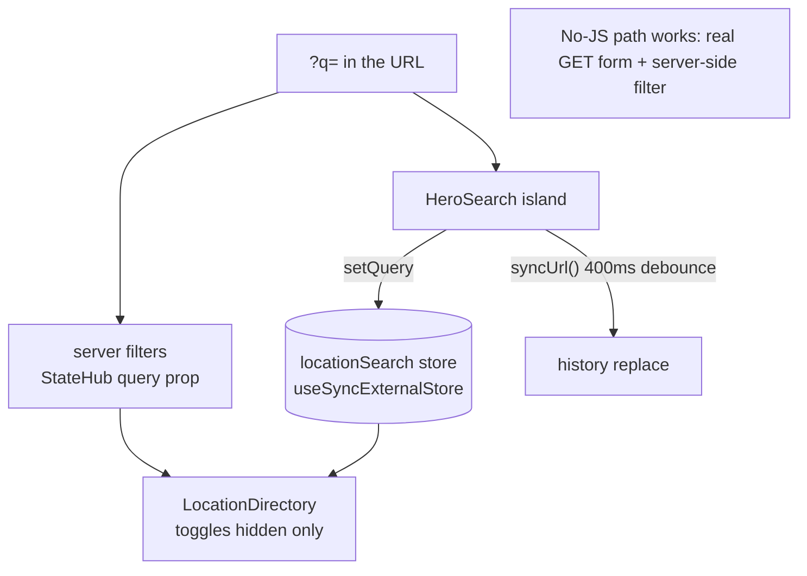

---

## 5. Template 3 — `ReferencePage` → `/location/[slug]/` (the live leaf)

Defined **inside** `app/location/[slug]/page.tsx` (1,466 lines). This is the only template the public
sees for the ~19k location URLs. It is not exported and has no file of its own.

### 5a. Dispatch

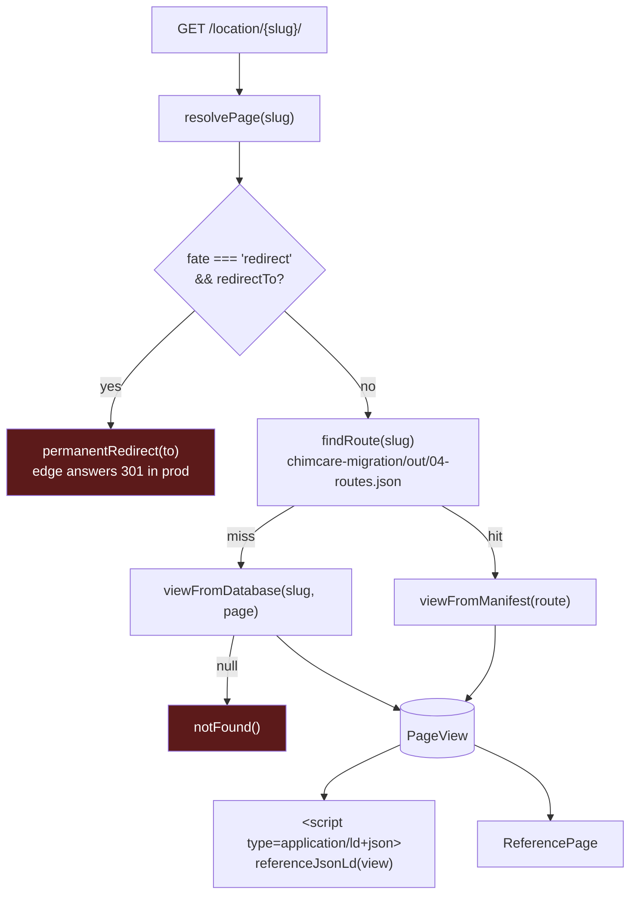

The manifest **wins** a tie. Both branches fill the same `PageView`, so the markup is identical; only
the data differs — the database branch resolves a region and therefore carries real prices, a seeded
hero photo, and the serving branch's phone and address.

| `PageView` field | manifest | database |
|---|---|---|
| `blocks` | pipeline's parse | `parseBody()` port of the same parser |
| `prices` | none (`isDefault` → `UNPRICED_OPTIONS`) | real, region-scoped |
| `phone`, `jobLocation`, `licenses` | from the row if present | branch row |
| `heroImage` | only if the pipeline carried one | seeded |
| `faqs` | manifest | seeded, slots filled |

### 5b. Block stream → sections

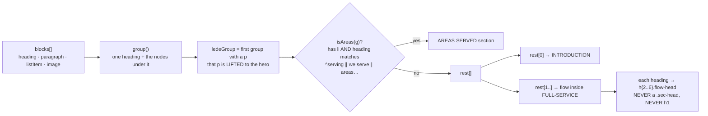

### 5c. Anatomy

```
╔═══════════════════════════════════════════════════════════════════════════╗
║ <section class="option o1 o1-migrated" data-source={manifest|database}>   ║
╠═══════════════════════════════════════════════════════════════════════════╣
║ 1 HERO  .hero.o1-hero   +.no-photo when view.heroImage is null            ║
║   ┌ .enter (left) ─────────────────────┬ .book-slot (right) ───────────┐  ║
║   │ nav.crumbs Home / Locations        │ <BookingForm embedded>        │  ║
║   │        [ / {state} / {city} ]  ⟵ only if slug parsed               │  ║
║   │ ul.hero-trust  CSIA · Since 1989 · Local  (fixed 3)                │  ║
║   │ p.eyebrow "{city}, {state}"   ⟵ conditional on place              │  ║
║   │ h1 {view.title}      ← the page's ONLY h1                          │  ║
║   │ p.lede  first paragraph of the body (removed from the body)        │  ║
║   │ ctas [Fast Online Booking][☎ Call {phone}]   ⟵ tel conditional    │  ║
║   │ p.addr  {jobLocation}          ⟵ conditional                      │  ║
║   │ figure.hero-figure             ⟵ conditional                      │  ║
║   │ ✗ NO star rating · ✗ NO award row — would be invented              │  ║
╠═══════════════════════════════════════════════════════════════════════════╣
║ 2 TRUST STRIP  .o1-trust — 3 × .t, written inline in the route            ║
╠═══════════════════════════════════════════════════════════════════════════╣
║ 3 INTRODUCTION  .section.o1-intro                                         ║
║   left  .reveal : eyebrow "Chimcare in {city}"(cond) · IntroHeading       ║
║                   ol.o1-reasons × 3 ← REASONS const (fire safety, air,    ║
║                   structure), numbered 01–03                              ║
║   right .copy   : <Body g={intro} firstFigureClass="team-photo"/>         ║
║                   introPlate fallback when the body has no image          ║
║                   [Schedule Service]                                      ║
╠═══════════════════════════════════════════════════════════════════════════╣
║ 4 WHY CHIMCARE  .o1-trust-copy.on-dark   ← dark band                      ║
║   eyebrow "Why Chimcare" · h2 · TRUST_COPY const · trustArt plate (cond)  ║
╠═══════════════════════════════════════════════════════════════════════════╣
║ 5 SERVICE ACCORDION  .section.o1-svc     ⟵ only if standardServices()     ║
║   .sec-head (+.one-col when no svcArt) · Accordion mode="single"          ║
║   per row: num · icon · h3.svc-name · p.svc-short                         ║
║            panel: .svc-main paragraphs + image ┆ .svc-side "What's        ║
║            included" ul + [Schedule Service]                              ║
║   source: app/location/standard-services.json — malformed file ⇒ NO       ║
║           section at all (wrong rows would be worse than none)            ║
╠═══════════════════════════════════════════════════════════════════════════╣
║ 6 FULL-SERVICE  .section.o1-solutions #o1-solutions                       ║
║   rendered when (flow.length > 0 || directory)                            ║
║   head: directory ? .sec-head(+one-col if no lede) : .sec-head.one-col    ║
║   <ServiceDirectory tiles cards count>  ⟵ only sibling pages that EXIST   ║
║   then {flow} — every remaining heading + body, in source order           ║
╠═══════════════════════════════════════════════════════════════════════════╣
║ 7 AREAS SERVED  .section.areas   ⟵ only when the body itself lists towns  ║
║   left: eyebrow · h2 {areas.heading} · p.lede (first p)                   ║
║   right: areasArt plate (only if body brought no image) + Body listClass  ║
║          ="area-list"                                                     ║
╠═══════════════════════════════════════════════════════════════════════════╣
║ 8 PROCESS  .section  — ALWAYS. STEPS const × 4: Inspect · Diagnose ·      ║
║   Clean or repair · Protect.  ol.o1-steps, .dot 01–04                     ║
╠═══════════════════════════════════════════════════════════════════════════╣
║ 9 PRICING  .section.o1-cost — ALWAYS, but branches:                       ║
║   view.prices ? "sweep+inspection is $X, inspection $Y, gas $Z…"          ║
║               : "price follows the work rather than a list" (NO figures)  ║
║   .factors × 4 COST_FACTORS · [Request a repair quote] [☎ phone]          ║
╠═══════════════════════════════════════════════════════════════════════════╣
║10 FAQ  .section  ⟵ only when view.faqs.length > 0                         ║
║   .sec-head.one-col "FAQ / Frequently Asked Questions" · Accordion single ║
╠═══════════════════════════════════════════════════════════════════════════╣
║11 CONTACT  .section.o1-contact — ALWAYS                                   ║
║   left: .contact-lines  pin(jobLocation + city,ST) · phone · Schedule     ║
║   right: .why-card "Why Chimcare?" × 3 — the licence line appends         ║
║          view.licenses only when the branch has them, else just "."       ║
╠═══════════════════════════════════════════════════════════════════════════╣
║12 FINAL  .section.o1-final  .panel.on-dark                                ║
║   eyebrow "Chimcare · {city}, {ST}" · h2 "Keep your {city} chimney safe." ║
║   side: [Schedule Service] a.phone · jobLocation                          ║
╚═══════════════════════════════════════════════════════════════════════════╝
   sibling:  <BookingSheet options={booking} context={bookingContext}/>
   ✗ no ServiceDrawer   ✗ no FloatingCta on this template
```

### 5d. What this template refuses to render

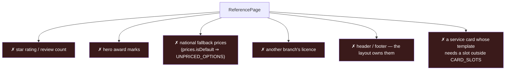

`CARD_SLOTS` is exactly `service.name`, `category.name`, `city.name`, `state.code`. A catalogue card
whose copy reaches for a price or a neighbourhood is **dropped**, never rendered with a literal
`{{slot}}`.

### 5e. Metadata + JSON-LD

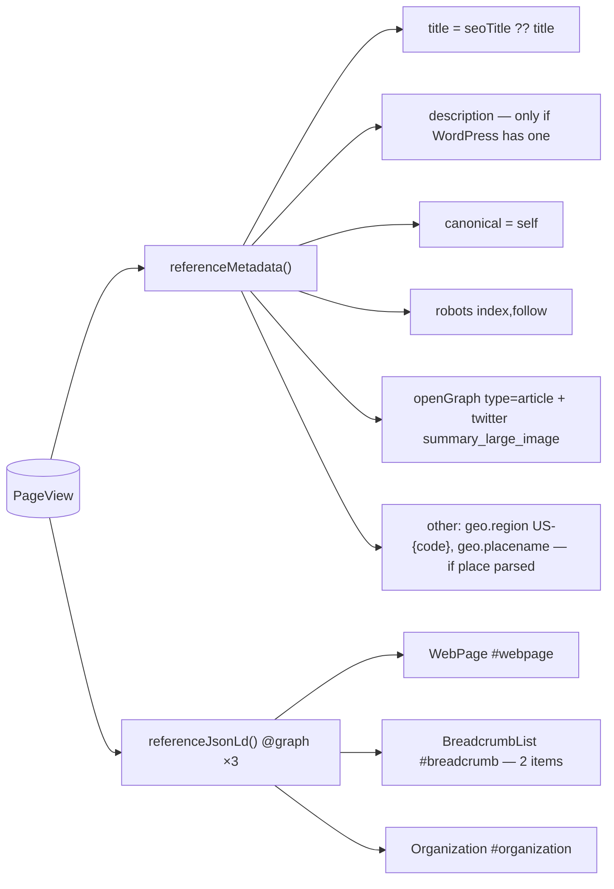

---

## 6. Template 4 — `LocationPage` (preview only)

`components/templates/LocationPage.tsx` · `/preview/location/[id]/` · `assembleLocationPage()`
Reads `data/sample/location-sample.jsonl`, a random cross-state sample. 404s in production.

This is the **fully section-optional** template: fourteen nullable slots, each rendered only when the
source or the master copy supplies it.

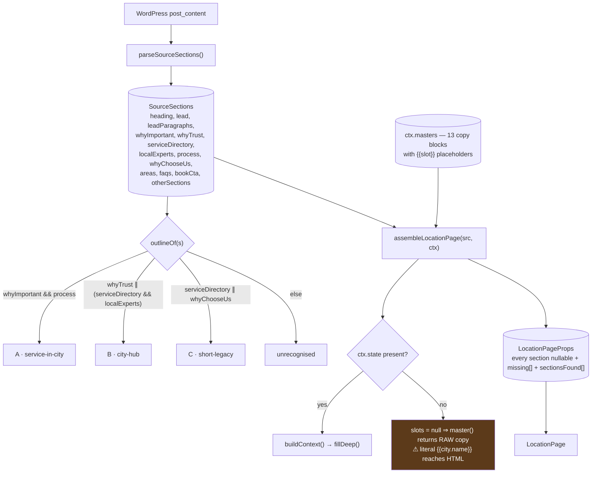

### The three source outlines

| | A · service-in-city (majority) | B · city hub (branch pages, the Spokane mock's origin) | C · short legacy (oldest OR/WA) |
|---|---|---|---|
| 1 | lead | lead | About Chimcare Chimney Sweep {city} |
| 2 | Why {service} Is Important in {city} | Why {city} Homeowners Trust Chimcare | lead |
| 3 | Our {service} Process in {city} | Our Full-Service … Solutions in {city} | Services: |
| 4 | Why Choose Us for {service} in {city} | Your {city} Fireplace Experts | What Makes Us Different: |
| 5 | Areas We Serve Around {city} | Serving Nearby Areas | — |
| 6 | FAQs | FAQ | — |
| 7 | Book Your {service} in {city} | — | — |

All three parse into the **same slots**, so one template renders all of them.

### Anatomy — ✓ always, ◆ conditional

```
╔════════════════════════════════════════════════════════════════════════════╗
║ ✓ 1 HERO .hero.o1-hero                                                     ║
║     crumbs built here: Home / Locations / [{stateName}] / {city||slug}      ║
║     ul.hero-trust ✓ (3 fixed)  ·  eyebrow ✓  ·  h1 = post_title verbatim ✓  ║
║     ◆ lede  ◆ .ctas tel  ◆ .hero-proof (rating ∥ awards)                    ║
║        └ rating includes an inline 4-colour Google "G" SVG                  ║
║     ◆ p.addr  ◆ figure.hero-figure + ◆ figcaption                           ║
║     ✓ .book-slot → <BookingForm embedded>                                   ║
║ ✓ 2 TRUST STRIP .o1-trust awards={false} — 3 items built in the assembler   ║
║ ◆ 3 INTRO .o1-intro   ⟵ s.whyImportant ∥ s.lead ∥ introMaster              ║
║     ◆ ol.o1-reasons (reasonsMaster) ┆ ◆ team photo · paragraphs · CTA       ║
║ ◆ 4 WHY TRUST .o1-trust-copy.on-dark  ⟵ s.whyTrust ∥ whyTrustMaster        ║
║ ◆ 5 SERVICE ROWS .o1-svc   ⟵ rowsMaster only (8 master rows)               ║
║     SectionHead WITH figure · Accordion single · per row: main ┆ side       ║
║     side has [CTA] + [Open full detail → data-drawer-open]                  ║
║ ◆ 6 SOLUTIONS .o1-solutions ⟵ ctx.catalog && solutionsMaster               ║
║     <ServiceDirectory> full catalogue grid + tiles                          ║
║ ◆ 7 SERVICE DIRECTORY (from source) — SAME id #o1-solutions ⚠ duplicate id  ║
║     plain .svc-grid of h3-only cards, from s.serviceDirectory.items         ║
║ ◆ 8 PROCESS #o1-process — ol.o1-steps when steps exist, ELSE .copy prose    ║
║ ◆ 9 AREAS .section.areas — eyebrow/h2/lede · ◆ plate · ◆ subHeading ·       ║
║     ul.area-list ✓ · [Book a visit]                                         ║
║ ◆10 WHY CHOOSE US .o1-contact — prose + ◆ .why-card "What you get"          ║
║ ◆11 CONTACT .o1-contact — ⚠ same id #o1-contact as 10                       ║
║     .contact-lines: ◆address ◆servedFrom ◆phone ✓Schedule online            ║
║ ◆12 OTHER × N — every heading the outlines did not claim, rendered plainly  ║
║ ◆13 COST .o1-cost — costMaster; .factors chips                              ║
║ ◆14 FAQ #o1-faq — s.faqs ∥ faqMaster                                        ║
║ ◆15 FINAL .o1-final.on-dark — s.bookCta ∥ final_cta master                  ║
╚════════════════════════════════════════════════════════════════════════════╝
  siblings: ✓ BookingSheet
            ◆ ServiceDrawer  (serviceRows.rows.length>0 && phone && phoneHref)
            ◆ FloatingCta    (phone && phoneHref)
```

**Body-wins rule.** Where the page's own body says a thing, the body wins; master copy fills only
what the body lacks. The hero lede is the exception — `heroMaster.lede` wins over `s.lead`, because
the body's opening paragraph is a full paragraph and belongs in the introduction (dropping it in the
hero doubled the hero's designed height).

**Prices** are always the pricing sheet, never the body, and are stored in **cents**
(`sweep_inspection: 29900`). Passing dollars here once rendered "$3" for a $299 service.

---

## 7. Template 5 — `CityPage` (preview only)

`components/templates/CityPage.tsx` · `/admin/preview/[slug]/` and `/preview/city/`
Everything is **required** — no section is conditional except the small proof elements.
This is `LocationPage`'s ancestor; the two share the `.o1-*` class system exactly.

```
 1 HERO      crumbs · ◆hero-trust · eyebrow · h1 · lede · [Schedule][☎ Call]
             ◆addr · ◆hero-proof (plain ★★★★★, NO Google SVG) · figure ✓
             .book-slot BookingForm ✓
 2 INTRO     o1-reasons ✓ · ◆team photo · paragraphs · CTA
 3 WHY TRUST dark band + HARDCODED /img/trust-art.webp 361×302
 4 SVC ROWS  Accordion single, 8 rows, drawer trigger per row
 5 SOLUTIONS ServiceDirectory (tiles + cards + count)
 6 AREAS     ◆plate · subHeading ✓ · subLede ✓ · area-list ✓ · CTA ✓
 7 PROCESS   ol.o1-steps ✓
 8 COST      panel + factors ✓
 9 FAQ       ✓
10 CONTACT   contact-lines incl. ◆Get Directions (external, rel=noopener)
11 FINAL     panel.on-dark + ◆addressLine in the side rail
 siblings: BookingSheet ✓  ServiceDrawer ✓  FloatingCta quoteHref="#o1-cost" ✓
 + <JsonLd data={p.jsonLd}> inside <main>
```

Differences from `LocationPage` worth naming:

| | CityPage | LocationPage |
|---|---|---|
| section optionality | all required | all nullable |
| trust strip | **not rendered** (`display:none` in the newest mock; its claims moved into `hero.trustLine`) | rendered |
| Google logo in rating | no | yes, inline SVG |
| trust art | hardcoded path | `DESIGN.trustArt`, nullable |
| Get Directions | yes | no |
| JSON-LD | yes | **none** |
| `--img-city` CSS var | yes | no |

---

## 8. Template 6 — `ServicePage` (preview only)

Derived from CityPage for a Tier A/B service×city URL, if decision Q1 keeps those as pages.

```
 1 HERO      crumbs · eyebrow · h1 · lede · ctas · ◆addr
             .book-slot BookingForm with initialService ← preselects the service
             ✗ no hero-trust · ✗ no proof row · ✗ no hero figure
 2 TRUST STRIP  <TrustStrip className="o1-trust">  awards DEFAULT true ⚠
 3 THE SERVICE  ◆p.row — SectionHead "What it involves"/{row.name}/{row.why}
                a single .o1-row.is-open with NO accordion button (always open)
                main paragraphs ┆ side "What's included" + CTA
 4 PROCESS   ol.o1-steps ✓
 5 COST      panel ✓
 6 RELATED   .section.areas #o1-related
             p.lede → the city page link · ul.area-list of sibling services
 7 FAQ       ✓
 8 FINAL     panel.on-dark ✓
 siblings: BookingSheet ✓ · ◆ServiceDrawer rows=[p.row] · FloatingCta ✓
 + JsonLd · section class "option o1 tpl-city tpl-service"
```

It is the **only** template that opts into the awards image inside the trust strip
(`awards` defaults to `true` and `ServicePage` does not pass `false`).

---

## 9. Template 7 — `LegacyPage` (preview only)

`components/templates/LegacyPage.tsx` · `/admin/preview/legacy/[pilot]/`
Reads `data/smoke-10/page-source.jsonl`, SHA-256 per row. The migration safety layer.

```
╔══════════════════════════════════════════════════════════════════════╗
║ <main class="tpl-legacy"> <article class="legacy"> <div class="wrap"> ║
║   Breadcrumbs                                                        ║
║   h1.legacy-title  ← post_title, unmodified                          ║
║   div.legacy-body  dangerouslySetInnerHTML ← cleanVerbatim(rawHtml)  ║
║   ◆ p.legacy-contact  [☎ Call {phone}]                               ║
║   ◆ aside.legacy-provenance   (showProvenance — reviewers only)      ║
║       dl: URL · WordPress post · Last modified · Source title tag ·  ║
║           Source description · Source canonical · Source robots      ║
║           — each row present ONLY when WordPress has the field       ║
║       "Render-time cleanup": either "byte-identical to the stored    ║
║        source" or a list of {id, count, defect, action} per rule     ║
╚══════════════════════════════════════════════════════════════════════╝
```

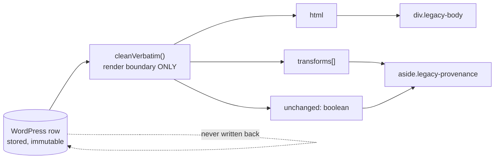

Guarantees: URL unchanged, content unchanged, source metadata carried through, image references
still point where WordPress pointed them. It will not invent a service, an FAQ, a heading, a
description or structured data — **there is deliberately no JSON-LD here**.

---

## 10. Utility pages

### `/` — `app/page.tsx`
Six lines. `redirect('/locations/')`. The homepage is out of scope for this slice.

### `not-found.tsx`
`main.tpl-hub` → one `.section` → eyebrow "404", h1 "We can't find that page.", lede with a link to
the locations directory. Still wrapped by the full header/footer/sticky-bar shell.

### `/admin/migration/` — the review table
```
 eyebrow · h1 "Minnesota migration status" · lede "{n} cities …"
 status chips: [All N] + one per sourceStatus, each an ?status= link
   SOURCE_PAGE_PUBLISHABLE → green · NO_SOURCE_PAGE → grey · else amber
 "Open flags — code (n) · code (n) …"  sorted desc
 table (min-width 1200, horizontal scroll):
   City(+preview →) │ Kind/tier │ Migration status │ Public │ Blocked by
   │ Needs review │ Source page │ Serving branch
 <MissingList> maps flag codes → human blockers, or "nothing — publishable"
```

### `/admin/bookings/` — the booking log
```
 eyebrow · h1 "Bookings" · lede "{n} most recent…"
 table (min-width 1100), 11 columns:
   Reference(mono) │ Created │ Status(+adapter:externalId) │ Service
   │ When(date + window) │ Customer │ Contact(phone/email) │ ZIP/address
   │ From page(kind + slug) │ City·state(+branch #) │ Notes
 empty state: one colSpan=11 row
 footer link → /api/bookings/
```

### `/preview/[template]/` — the fixture harness
`generateStaticParams` over `['national','state','city','service','legacy']`. Refuses to run when
`NODE_ENV === 'production'`. Renders a red `#8A1A12` banner (`data-fixture-banner`, z-index 60)
above the chosen template, fed from `lib/fixtures/templates.ts`. Never touches the database.

### `/preview/location/[id]/` — the sample harness
Dark diagnostic strip above `LocationPage`: state · URL · `wp #id` · byte count ·
**detected outline** · `sectionsFound` joined · `missing` in red · then a chip link to every other
sample row.

### `/admin/preview/[slug]/` — the migration preview
Dark banner above `CityPage`: "not published, not indexed", city · sourceStatus · WordPress post id ·
gate verdict (`passes validation` or `blocked by: …`), preserved-but-unrendered legacy pricing
quotes, and a note that sections fall back to master copy.

---

## 11. Cross-page patterns

### 11a. Section-shape grammar

Every content template is built from the same five primitives.

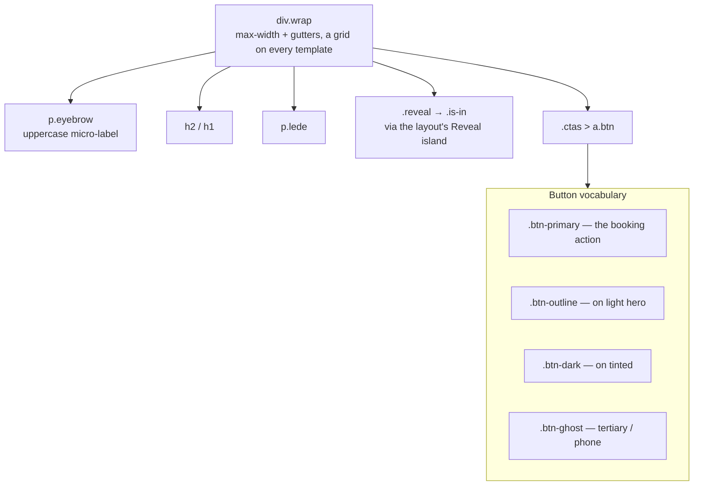

`SectionHead` is the canonical head: `{eyebrow, heading, lede?, left?, figure?, figureId?}`.
When a `figure` is supplied the lede moves into `.sec-head-lede` beside the heading instead of
sitting in the second column. `ReferencePage` deliberately opts out — it uses raw `.sec-head`
markup and `.flow-head` headings, because a migrated body brings ~26 headings and dressing each as
a section head turned the article into 49 title blocks.

### 11b. The booking chain — one contract, three entry points

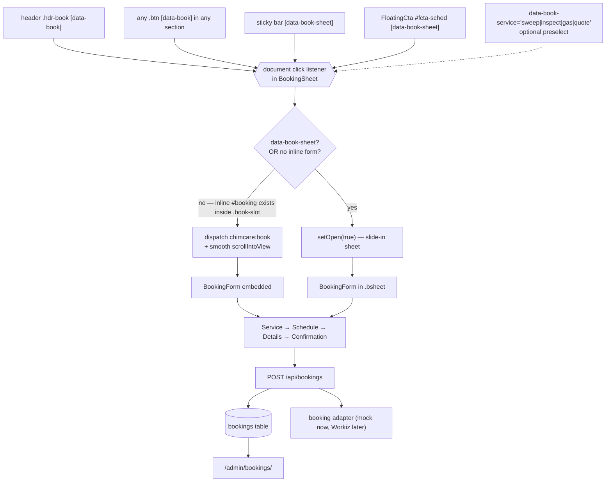

`BookingContext` travels with every submission: `pageSlug`, `pageKind`, `label`, and — when known —
`stateCode`, `stateName`, `cityName`, `cityId`, `branchId`, `branchName`. That is what makes the
admin table able to say which page a lead came from.

### 11c. Which templates mount which islands

| Island | NationalHub | StateHub | ReferencePage | LocationPage | CityPage | ServicePage | LegacyPage |
|---|---|---|---|---|---|---|---|
| `BookingForm` (inline, `.book-slot`) | — | — | ✓ | ✓ | ✓ | ✓ | — |
| `BookingSheet` | ✓ | ✓ | ✓ | ✓ | ✓ | ✓ | — |
| `ServiceDrawer` | — | — | — | ◆ | ✓ | ◆ | — |
| `FloatingCta` | ✓ `#booking` | ✓ `#directory` | **—** | ◆ `#booking` | ✓ `#o1-cost` | ✓ `#o1-cost` | — |
| `Accordion` | — | ✓ multi | ✓ single ×2 | ✓ single ×2 | ✓ single ×2 | — | — |
| `ServiceDirectory` | — | — | ◆ | ◆ | ✓ | — | — |
| `StateDirectory` + `NationalFinder` | ✓ | — | — | — | — | — | — |
| `LocationDirectory` + `HeroSearch` + `MapPanel` | — | ✓ | — | — | — | — | — |
| `HeaderMenu`, `Reveal` | layout — every page | | | | | | |

`ReferencePage` having no `FloatingCta` is the one asymmetry in the public set.

### 11d. Dialogs are siblings of `<main>`

Every template that has one places `BookingSheet`, `ServiceDrawer` and `FloatingCta` **outside**
`<main>`. Nested inside a section they would be positioned against it rather than the viewport, and
a closed panel parked off-canvas would widen the document.

`FloatingCta` turns on only when the booking anchor has scrolled past **and** no dialog is open:

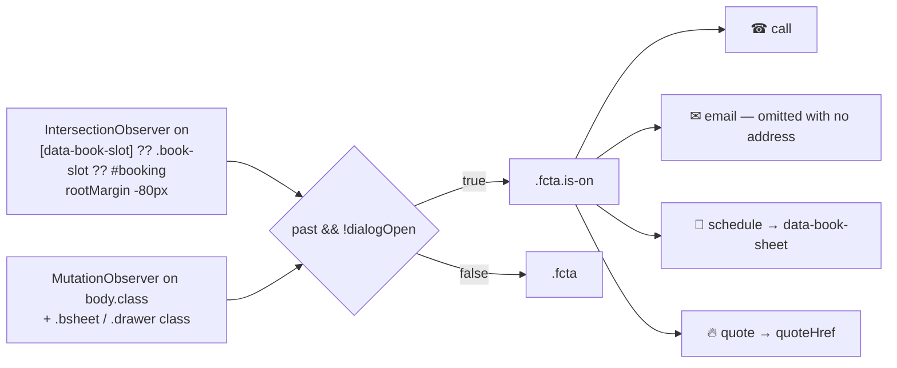

### 11e. Progressive enhancement

| Feature | Server HTML | Client adds |
|---|---|---|
| state/city search | filtered by `?q=`, real GET form | per-keystroke filter + 400 ms URL sync |
| location directory | **all** cards present (crawlable internal links) | toggles `hidden`, Load more |
| service directory | all 92+ cards present | category filter, reveal in steps of 8 |
| accordions | item 0 carries `is-open` and `aria-expanded="true"` | open/close, single vs multi |
| map | degraded list of every location + phone | show/hide toggle only — Leaflet is not a dependency |
| booking | — | fully client; the sticky bar is inert without the sheet |

### 11f. Conditional-rendering discipline

One rule across every template: **a section the source cannot support is not rendered** — no
placeholder, no borrowed content, no invented heading.

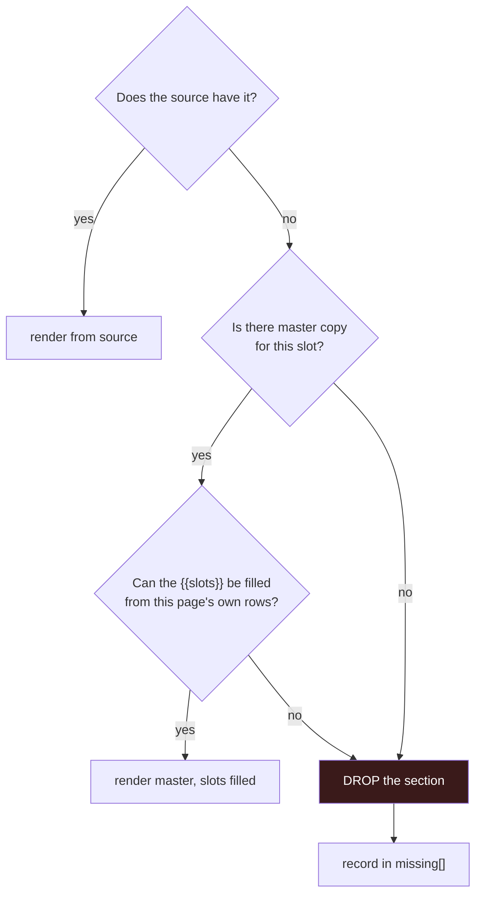

Three separate implementations of the same rule:
- `assembleLocationPage` → `missing[]` + `sectionsFound[]`, surfaced by the preview strip.
- `ReferencePage` → `standardServices()` returns `[]` on a malformed file, so the accordion vanishes.
- `cardFillable()` → a catalogue card needing a slot outside `CARD_SLOTS` is dropped.

**The known breach.** In `assemble-location.ts`, `slots` is `null` whenever `ctx.state` is null, and
`master()` then returns raw copy. 1,416 published MN legacy pages render ~43–45 literal
`{{city.name}}` / `{{state.code}}` / `{{price.*}}` tokens. This contradicts CLAUDE.md's "an unknown
slot throws". `ReferencePage` does not have this defect — `localise()` returns `null` and the caller
drops the sentence.

### 11g. Structured data

| Route | JSON-LD |
|---|---|
| `/locations/` | `<JsonLd data={p.jsonLd}>` — 1 block |
| `/locations/[state]/` | `<JsonLd data={p.jsonLd}>` — 1 block |
| `/location/[slug]/` | raw `<script type="application/ld+json">`, `@graph` of WebPage + BreadcrumbList + Organization |
| `CityPage` / `ServicePage` | `<JsonLd>` — but preview-only, so not public |
| `LocationPage` | **none** — `assemble-location.ts` has no `jsonLd`, and the old `cityJsonLd()` in `assemble.ts` is orphaned |
| `LegacyPage` | none, deliberately |

### 11h. Trust and proof, by template

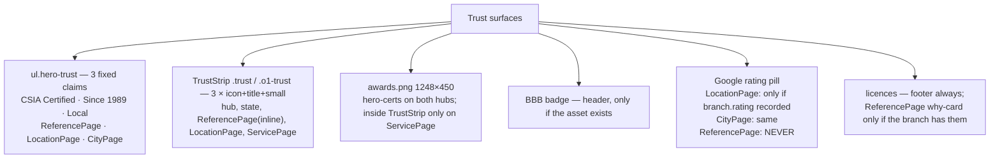

### 11i. Known structural defects

| Where | Defect |
|---|---|
| `LocationPage` sections 6 and 7 | both use `id="o1-solutions"` — duplicate id when both render |
| `LocationPage` sections 10 and 11 | both use `id="o1-contact"` |
| `ReferencePage` | no `FloatingCta`, unlike every other template that has a booking anchor |
| `Header` NAV | Services, About Us, Contact are all `href="#"` |
| `Footer` policies | Privacy, Terms, Cookie, Accessibility, DNSMI are all `href="#"` |
| `Footer` services | all 10 point at `#booking`, none at a service page |
| `LocationPage` | no JSON-LD at all |
| `assemble-location.ts` | null-`slots` fallback leaks `{{slot}}` to public HTML |

---

## 12. One-glance section matrix

✓ always · ◆ conditional · — absent

| # | Section | NatHub | StateHub | ReferencePage | LocationPage | CityPage | ServicePage | Legacy |
|---|---|:--:|:--:|:--:|:--:|:--:|:--:|:--:|
| 1 | Breadcrumbs | ✓ | ✓ | ✓ | ✓ | ✓ | ✓ | ✓ |
| 2 | Hero + h1 | ✓ | ✓ | ✓ | ✓ | ✓ | ✓ | ✓ (title only) |
| 3 | Hero search / finder | ✓ | ✓ | — | — | — | — | — |
| 4 | Hero trust line | — | — | ✓ | ✓ | ◆ | — | — |
| 5 | Hero proof (rating/awards) | — | — | — | ◆ | ◆ | — | — |
| 6 | Hero figure | — | — | ◆ | ◆ | ✓ | — | — |
| 7 | Inline booking form | — | — | ✓ | ✓ | ✓ | ✓ | — |
| 8 | Hero meta counters | ✓ | ✓ | — | — | — | — | — |
| 9 | Hero certs (awards.png) | ✓ | ✓ | — | — | — | — | — |
| 10 | Trust strip | ✓ | ✓ | ✓ | ✓ | — | ✓ | — |
| 11 | Editorial intro | ✓ | ✓ | ✓ | ◆ | ✓ | — | — |
| 12 | Numbered reasons | — | — | ✓ (3) | ◆ | ✓ | — | — |
| 13 | Dark "why trust" band | — | — | ✓ | ◆ | ✓ | — | — |
| 14 | State cards | ✓ | — | — | — | — | — | — |
| 15 | City directory | ✓ | ✓ | — | — | — | — | — |
| 16 | Map panel | — | ✓ | — | — | — | — | — |
| 17 | Editorial blocks (.ed) | — | ✓ | — | — | — | — | — |
| 18 | Service accordion | — | ✓ (detail) | ◆ | ◆ | ✓ | ◆ (1 row) | — |
| 19 | Service directory grid | — | — | ◆ | ◆ | ✓ | — | — |
| 20 | Source-flow headings | — | — | ✓ | ◆ (other) | — | — | ✓ (raw) |
| 21 | Areas served | — | — | ◆ | ◆ | ✓ | — | — |
| 22 | Process steps | — | — | ✓ (4) | ◆ | ✓ | ✓ | — |
| 23 | Pricing panel | — | — | ✓ | ◆ | ✓ | ✓ | — |
| 24 | Related services | — | — | — | — | — | ✓ | — |
| 25 | FAQ | — | — | ◆ | ◆ | ✓ | ✓ | — |
| 26 | Contact block | — | — | ✓ | ◆ | ✓ | — | ◆ |
| 27 | Why-card | — | — | ✓ | ◆ | ✓ | — | — |
| 28 | Crew | ✓ | ✓ | — | — | — | — | — |
| 29 | Final CTA panel | ✓ | ✓ | ✓ | ◆ | ✓ | ✓ | — |
| 30 | Provenance aside | — | — | — | — | — | — | ◆ |
| 31 | JSON-LD | ✓ | ✓ | ✓ | — | ✓ | ✓ | — |

---

## 13. Stylesheet ownership

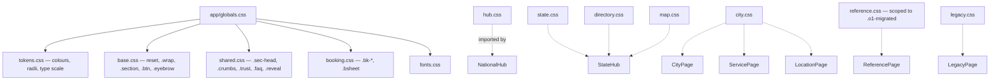

`reference.css` being scoped to `.o1-migrated` is why `ReferencePage` keeps that class even though
both of its data sources now render identical markup. `data-source` is the signal that replaced it.
