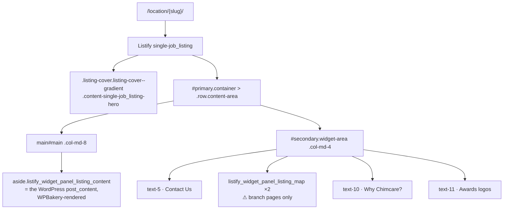
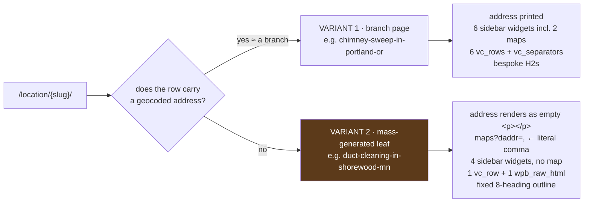
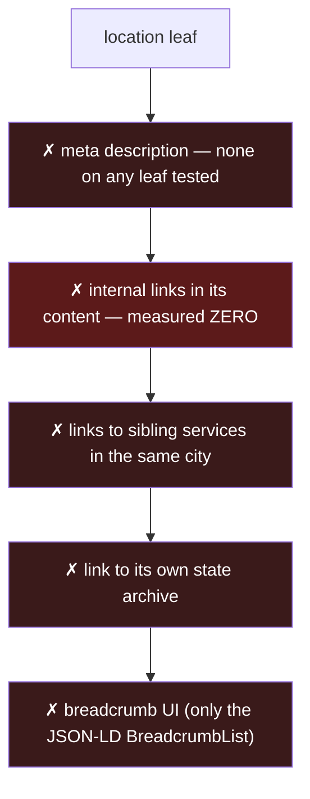
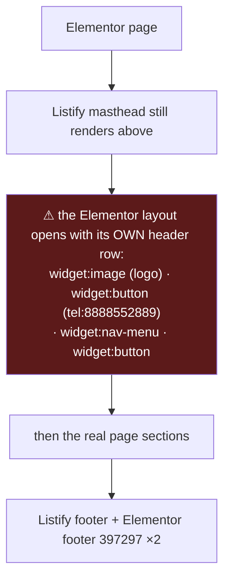
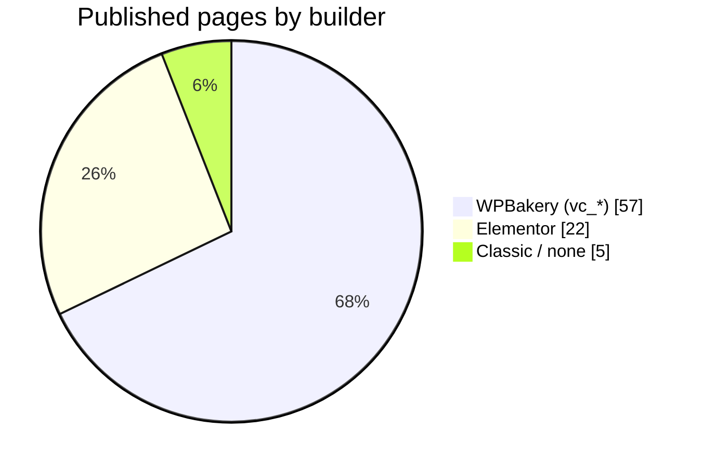
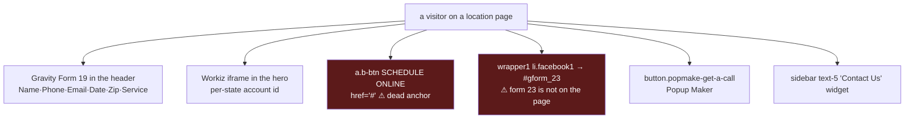
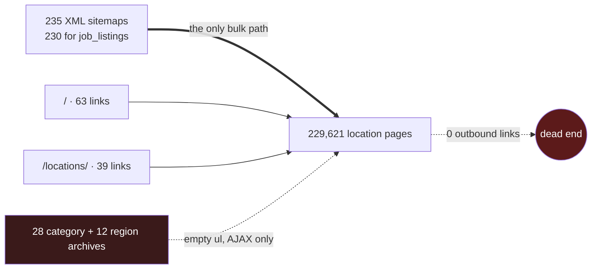
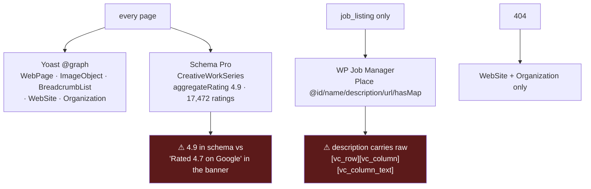

# Page Anatomies — the LIVE chimcare.com

The production WordPress site, as it actually renders. Not the Next.js rebuild.

**How this was derived (2026-09-11)**
- 23 live pages fetched over HTTPS from `https://www.chimcare.com` and parsed from the real HTML.
- The URL universe, post types, templates and taxonomies read from the local WordPress mirror
  `chimcare_local` (MySQL, read-only).
- Every number below is measured, not estimated. Nothing comes from the design mocks.

Stack: **WordPress · theme `listify` + child `listify-child`** · WP Job Manager (`job_listing`) ·
WPBakery (`vc_*`) · Elementor · Gravity Forms · Yoast SEO · Schema Pro 2.10.5 · Workiz booking ·
WP Mobile Menu · Popup Maker · GTM `GTM-WQSR5DC` · Cloudflare.

---

## 1. The live URL universe

```mermaid
flowchart TD
  R["https://www.chimcare.com"]:::rt

  R --> A["/ — front page<br/>page_on_front = 337148<br/>template: default · built in Elementor"]:::el
  R --> B["/location/{slug}/<br/><b>229,621 published job_listing</b>"]:::big
  R --> C["/locations/{state-term}/<br/>job_listing_category — 28 terms"]:::tax
  R --> D["/location-region/{state}/<br/>job_listing_region — 12 terms"]:::tax
  R --> E["84 published pages<br/>(+22 draft)"]:::pg
  R --> F["/blog/ + 161 published posts"]:::pg
  R --> G["404"]:::err

  B --> B1["A · {service}-in-{city}-{st}<br/>204,964"]
  B --> B2["B · {something}-{st}<br/>15,500"]
  B --> B3["D · other<br/>7,927"]
  B --> B4["C · contains chimney-sweep<br/>1,230"]

  E --> E1["template-full-width-blank.php · 36"]
  E --> E2["elementor_header_footer · 19"]
  E --> E3["template-full-width.php · 11"]
  E --> E4["default · 8"]
  E --> E5["template-home.php · 6"]
  E --> E6["template-single-column · 1"]
  E --> E7["template-widgetized · 1 ⚠ times out"]
  E --> E8["template-archive-job_listing · 1"]
  E --> E9["elementor_canvas · 1"]

  classDef rt fill:#1a3a5c,stroke:#4a90d9,color:#fff
  classDef big fill:#5c1a1a,stroke:#d94a4a,color:#fff
  classDef tax fill:#1a5c3a,stroke:#4ad990,color:#fff
  classDef pg fill:#2d2d35,stroke:#888,color:#fff
  classDef el fill:#5c4a1a,stroke:#d9a94a,color:#fff
  classDef err fill:#3a1a1a,stroke:#a55,color:#fff
```



**Permalinks** are `/%postname%/`. `job_listing` is rewritten to `/location/`, its category to
`/locations/`, its region to `/location-region/`.

**XML sitemaps**: 235 shards — 230 × `job_listing-sitemap{n}.xml`, plus one each for
`job_listing_category`, `job_listing_region`, `page`, `post`, `mailpoet_page`.

### Taxonomy reality

`job_listing_category` holds 28 terms but they cover only **1,971 of the 229,621** listings.
11 of the 28 terms have a count of **zero** (Florida, New York, Michigan, Indiana, Pennsylvania,
Tennessee, Kansan *(sic)*, North Carolina, Missouri, Texas, Oregon Showrooms) and still get a live,
indexable, empty archive page. `job_listing_type` has five terms — Full Time, Part Time, Temporary,
Freelance, Internship — **all with a count of zero**, and its filter UI renders on every archive.

---

## 2. The global shell — identical on every single page

Every URL, including the 404, ships the same chrome. This is the single most important fact about
the live site's anatomy: **~300 KB of identical boilerplate precedes any page-specific content.**

```
╔══════════════════════════════════════════════════════════════════════════════╗
║ <head>  ~197 KB  ·  30–47 inline <style> blocks  ·  only 2–5 external CSS     ║
║   Yoast: title, og:*, twitter:*, canonical, JSON-LD @graph                    ║
║   Schema Pro: CreativeWorkSeries aggregateRating 4.9 / 17,472                 ║
║   GTM-WQSR5DC  ·  Cloudflare email-protection  ·  2 preload/preconnect        ║
╠══════════════════════════════════════════════════════════════════════════════╣
║ <header id="masthead" class="site-header">                                   ║
║  ├ .primary-header > .container > .primary-header-inner                      ║
║  │   ├ .site-branding  a.custom-header > img chimcare-logo.png               ║
║  │   │                 h2.site-title "Chimcare"                              ║
║  │   │                 h3.site-description "Chimney Sweep & Masonry Services"║
║  │   ├ .primary.nav-menu  ul#menu-home-new-design                            ║
║  │   │     Home · Services · Locations · About Us · Contact Us · [Call Us Now]║
║  │   └ .header-phone  a.tip tel:1-800-362-4840                               ║
║  ├ <nav id="site-navigation" class="main-navigation">   ← the SAME menu again║
║  │     .navigation-bar-toggle + ul#menu-home-new-design-1 + .header-phone     ║
║  ├ .getaCall-container > button.accordion.popmake-get-a-call  "Get a Call"    ║
║  └ #gform_wrapper_19 — Gravity Form 19 "Chimcare Booking Form V2"            ║
║        honeypot(LinkedIn) · Full Name* · Phone* · Email* · Date(datepicker)   ║
║        · Zip Code* · Select Service*  → submit                               ║
║        every label is .screen-reader-text (placeholder-driven)               ║
╠══════════════════════════════════════════════════════════════════════════════╣
║ 69 × <div class="wrapper1 {Branch}">     ~102–112 KB, CSS-selected            ║
║   one per branch: Hingham, Boston, Seattle-Tacoma, Newport, Cleveland,        ║
║   Wheaton, Milwaukee, Atlanta, Minneapolis, Akron, Eugene, Providence …       ║
║   each: ul > li.phone1 (tel) · li.email1 (cf-protected) · li.facebook1        ║
║         (calendar → #gform_23) · li.gas (→ /estimate/)                        ║
║   ALL 69 are in the HTML of EVERY page; CSS shows one.                        ║
╠══════════════════════════════════════════════════════════════════════════════╣
║ <div id="content" class="site-content">   ← the only part that varies         ║
╠══════════════════════════════════════════════════════════════════════════════╣
║ .footer-wrapper                                                              ║
║  └ <footer class="site-footer-widgets"> .container > .row                    ║
║      3 × .footer-widget-column, two of which each contain a                   ║
║      widget_custom_html holding the SAME Elementor footer template            ║
║      <footer class="elementor elementor-397297"> with 4 top sections          ║
║      → the footer template is rendered TWICE per page                         ║
║ <footer id="colophon" class="site-footer">                                    ║
║   .site-info · ul#menu-footer: About · Blog · FAQ · Terms · Privacy · Sitemap ║
╠══════════════════════════════════════════════════════════════════════════════╣
║ #ajax-response · #listify-login-popup (wp-login form, public)                 ║
║ .mobmenu-overlay + .mob-menu-header-holder + .mobmenu-right-panel             ║
║   → a THIRD copy of the main menu, from WP Mobile Menu                        ║
║ Popup Maker: pum-84508, pum-86011, popmake-get-a-call                         ║
╚══════════════════════════════════════════════════════════════════════════════╝
```



```mermaid
flowchart TD
  subgraph SHELL["every page ships all of this"]
    H["&lt;head&gt; ~197 KB"] --> M["masthead<br/>menu copy 1"]
    M --> N["nav#site-navigation<br/>menu copy 2"]
    N --> GF["Gravity Form 19<br/>booking, 6 fields"]
    GF --> W["69 × div.wrapper1.{Branch}<br/>~107 KB"]
    W --> C(["#content — the page"])
    C --> FW["footer widgets<br/>Elementor 397297 ×2"]
    FW --> CO["#colophon + footer menu"]
    CO --> MM["mobile menu<br/>menu copy 3"]
    MM --> PU["login popup + 2 Popup Maker popups"]
  end
  style C fill:#1a5c3a,color:#fff
  style W fill:#5c1a1a,color:#fff
```

### Weight budget — measured bytes of live HTML

| Page | Total | `<head>` | wrapper1 | own content | own content as % |
|---|---:|---:|---:|---:|---:|
| `/location/duct-cleaning-in-shorewood-mn/` | 508,886 | 197,844 | 112,009 | 17,574 | 3.5% |
| `/location/chimney-sweep-in-portland-or/` | 508,195 | 197,844 | 112,009 | 16,915 | 3.3% |
| `/about/` | 483,666 | 198,479 | 102,289 | 5,571 | 1.2% |
| `/financing/` | 483,277 | 198,266 | 102,289 | 5,477 | 1.1% |
| `/locations/` | 496,411 | 200,976 | 102,289 | 18,435 | 3.7% |
| `/` (home) | 801,709 | 300,826 | 102,289 | 206,508 | 25.8% |
| `/blog/` | 828,380 | 197,988 | 102,289 | 349,349 | 42.2% |
| `/contact-us/` | 601,928 | 233,525 | 102,289 | 93,199 | 15.5% |
| 404 | 468,727 | 187,748 | 102,127 | 1,041 | 0.2% |

Script tags per page: **72–94**. Inline `<style>` blocks: **31–47**.

---

## 3. Template A — the location leaf `/location/{slug}/`

**229,621 pages — 99.9% of the site.** `single-job_listing`, rendered by Listify.



### Wireframe

```
╔═══════════════════════════════════════════════════════════════════════════════╗
║ HERO  .listing-cover--gradient.has-image  (2 columns)                         ║
║ ┌───── .hero-company col-md-6 ──────────┬── .hero-right col-md-6 ───────────┐ ║
║ │ h1.job_listing-title                  │ .acf-header-right                 │ ║
║ │   "{Service} in {City},{ST}"  ⚠no space│  #schedule.{state}-form.sea-tac   │ ║
║ │ .acf-header-content > .newport-banner │   <iframe                         │ ║
║ │   img.man  expert cut-out             │    online-booking.workiz.com      │ ║
║ │   h2.ex-chm   "Experts in Chimney"    │    ?ac={per-state account}>        │ ║
║ │   h3.cfs      "Call for Service:"     │                                   │ ║
║ │   a.b-number  {branch phone}          │  OR = 1690d28a7e                  │ ║
║ │   a.b-btn     "SCHEDULE ONLINE" 📅    │  IL = 83e6195860                  │ ║
║ │   p.googlerate "Rated 4.7 on Google"  │  MA = e3e29c3114                  │ ║
║ │   img.rating  google-rating.png       │  MN = 94c117e3cd                  │ ║
║ │   h4.bt-heading "Contact Us for       │                                   │ ║
║ │                  Dust Free Cleaning"  │                                   │ ║
║ │ .job_listing-location                 │                                   │ ║
║ │   a.full-address → maps?daddr={lat,lng}│                                  │ ║
║ │ .job_listing-phone                    │                                   │ ║
║ └───────────────────────────────────────┴───────────────────────────────────┘ ║
╠═══════════════════════════════════════════════════════════════════════════════╣
║ #primary.container > .row.content-area                                        ║
║ ┌──── main#main col-md-8 ─────────────────┬──── #secondary col-md-4 ────────┐ ║
║ │ aside.listify_widget_panel_listing_     │ aside#text-5                    │ ║
║ │       content-2                         │   h2.widget-title "Contact Us"  │ ║
║ │  └ the post_content, WPBakery:          │   ⚠ title attr renders "%s"     │ ║
║ │     .vc_row > .wpb_column > .vc_column- │ aside#listify_widget_panel_     │ ║
║ │       inner > .wpb_wrapper >            │       listing_map-4   ◆         │ ║
║ │       .wpb_text_column                  │   #listing-contact-map (Google) │ ║
║ │     .vc_separator between blocks        │   .job_listing-location         │ ║
║ │     .vc_tta-container accordion = FAQ   │   a#get-directions + form       │ ║
║ │     .wpb_raw_html (mass-generated only) │ aside#listify_widget_panel_     │ ║
║ │                                         │       listing_map-3   ◆         │ ║
║ │                                         │   .job_listing-phone            │ ║
║ │                                         │ aside#text-10                   │ ║
║ │                                         │   h3 "Why Chimcare?" + img      │ ║
║ │                                         │ aside#text-11                   │ ║
║ │                                         │   img Awards.webp               │ ║
║ └─────────────────────────────────────────┴─────────────────────────────────┘ ║
╚═══════════════════════════════════════════════════════════════════════════════╝
```

### Two live sub-variants



**Variant 2's heading outline is identical on every page**, only the city and service substituted:

```
H1 (hero)  {Service} in {City},{ST}          ← no space after the comma
H1 (body)  {Service} in {City}, {ST}         ← WITH a space. Two H1s, different text.
H2  Experts in Chimney Sweep & Chimney Repairs in {City}   ← always "Chimney Sweep",
                                                              even on a Duct Cleaning page
H2  Why {Service} Is Important in {City}
H2  Our {Service} Process in {City}
H2  Why Choose Us for {Service} in {City}, {ST}
H2  Areas We Serve Around {City}
H2  FAQs                        ← rendered as a .vc_tta-accordion
H2  Book Your {Service} in {City}, {ST}
H2  Contact Us
```

Variant 1 (Portland) instead writes bespoke H2s: *Why Chimney Cleaning Matters in Portland, OR* ·
*What to Expect From Our Certified Chimney Sweep Team* · *Affordable Chimney Cleaning Tailored to
Portland Homeowners* · *DIY Chimney Maintenance vs. Professional Chimney Sweep Services*.

### What the leaf does NOT have



### Structured data on a leaf

| Emitter | Type | Note |
|---|---|---|
| Yoast | `WebPage`, `ImageObject`, `BreadcrumbList`, `WebSite`, `Organization` | one `@graph` |
| Schema Pro | `CreativeWorkSeries` + `AggregateRating` **4.9 / 17,472** | site-wide, on every page |
| WP Job Manager | `Place` with `@id`, `name`, `description`, `url`, `hasMap` | listing-only |

⚠ The `Place.description` is the raw excerpt **including WPBakery shortcodes**:
`"[vc_row][vc_column][vc_column_text] Duct Cleaning in Shorewood, MN Maintaining clean air ducts…"`.
⚠ The visible banner claims **4.7 on Google**; the schema on the same page claims **4.9**.

---

## 4. Template B — job listing archives

Three URL families share one Listify archive template.

| URL | What it is | Terms |
|---|---|---|
| `/locations/{term}/` | `job_listing_category` archive — the state hubs | 28 |
| `/location-region/{state}/` | `job_listing_region` archive | 12 |
| `/chimney-sweep-near-me/` | a *page* using `template-archive-job_listing.php` | 1 |

```
╔══════════════════════════════════════════════════════════════════════════════╗
║ .archive-job_listing-toggle-wrapper                                          ║
║    [ Results ]  [ Map ]        ← a.archive-job_listing-toggle                 ║
╠══════════════════════════════════════════════════════════════════════════════╣
║ .job_listings-map-wrapper.listings-map-wrapper--right                        ║
║    #job_listings-map-canvas                                                  ║
╠══════════════════════════════════════════════════════════════════════════════╣
║ #primary.container > .row.content-area > main#main.col-12                    ║
║  .job_listings                                                               ║
║    a.js-toggle-area-trigger "Toggle Filters"                                 ║
║    form.job_filters                                                          ║
║      .search_location   (text)                                               ║
║      select#search_categories                                                ║
║      select#search_region   ◆ region archive only                            ║
║      p "Filter by type:" + ul.job_types                                      ║
║         ☐ Freelance ☐ Full Time ☐ Internship ☐ Part Time ☐ Temporary        ║
║         ⚠ job-board leftovers — all five terms have a count of 0             ║
║      button.update_results "Update"   ·   .showing_jobs (empty)              ║
║    h1  {term name}                        ← e.g. "Chimcare Locations in MA"  ║
║    <ul class="job_listings"></ul>         ⚠ EMPTY IN THE SERVER HTML         ║
║                                              results arrive by AJAX only     ║
║  section.seo-content.mt-5     ◆ category archives only                       ║
║    H2 "Chimcare: Your Premier {State} Chimney Sweep, Repair and Service…"    ║
║    H3 {State} Chimney Sweep Services                                         ║
║    H3 {State} Chimney Repair                                                 ║
║    H3 {State} Chimney Inspection                                             ║
║    H3 Masonry Services                                                       ║
║    H3 Gas and Wood-Burning Inserts                                           ║
║    H3 Why Choose Chimcare?                                                   ║
╚══════════════════════════════════════════════════════════════════════════════╝
```

`/chimney-sweep-near-me/` is the one page on this template. It carries **two H1s** — one from the
page title, one from the archive loop — and renders **no footer widget area** at all
(0 Elementor sections, 0 widgets), unlike every other page on the site.

---

## 5. Template C — `template-home.php` (6 pages)

Used by `/oregon/`, `/washington/`, `/ohio/`, `/loyalty-program/`, `/home-page/`, `/footer/`.

```
╔══════════════════════════════════════════════════════════════════════════════╗
║ .homepage-cover.entry-cover.entry-cover--home                                ║
║   .cover-wrapper.container > .listify_widget_search_listings                 ║
║     h1.home-widget-title                                                     ║
║       "The USA's Most Trusted Chimney Sweep, Chimney Repair, Masonry and      ║
║        Fireplace Company"      ⚠ the SAME H1 on all six pages                 ║
║     form.job_search_form                                                     ║
║       .search_location · ul.job_types (the 5 dead terms) · Update            ║
╠══════════════════════════════════════════════════════════════════════════════╣
║ .container.test.homepage-hero-style-image                                    ║
║   article > .content-box-inner > .entry-content > .wpb-content-wrapper       ║
║     WPBakery rows — on /oregon/ this is the Loyalty Program:                 ║
║       H2 Sign Up For Loyalty Program                                         ║
║       H2 SILVER   H3 $15 per month                                           ║
║       H2 GOLD     H3 $29 per month                                           ║
║       H2 PLATINUM H3 $89 per month                                           ║
╚══════════════════════════════════════════════════════════════════════════════╝
```

Note the page is titled "Oregon" and lives at `/oregon/`, but its H1 is the generic national
strapline and its body is the loyalty-programme price table. There are **two published pages named
"Ohio" and two named "Washington"** in the database, on different templates.

---

## 6. Template D — WPBakery pages (`full-width` / `full-width-blank`, 47 pages)

The largest page family: `/about/`, `/chimney-sweep/`, `/locations/`, `/sitemap/`, `/blog/`,
`/financing/`, `/frequently-asked-questions-3/`, `/portland-team/`, all the service and how-to pages.

```
╔══════════════════════════════════════════════════════════════════════════════╗
║ .page-cover.page-cover--large|--default.has-image                            ║
║    h1.page-title.cover-wrapper   {page title}     ← the featured image band  ║
╠══════════════════════════════════════════════════════════════════════════════╣
║ #primary.container > .content-area > main#main.site-main                     ║
║   article#post-{id} > .content-box-inner > .entry-content                    ║
║     .wpb-content-wrapper                                                     ║
║       .vc_row > .wpb_column.vc_col-sm-8   ← the prose                        ║
║       .vc_row > .wpb_column.vc_col-sm-4   ← the standing right rail:         ║
║             H3 "Call Us for a Quick Booking"                                 ║
║             H3 "Why Chimcare?"                                               ║
║             images: chimney-cleaning.png · gas-fireplace-service.png          ║
║                     refer.png · chimcare-adds.webp · awards.png              ║
╚══════════════════════════════════════════════════════════════════════════════╝
```

That 8/4 split with the "Call Us for a Quick Booking / Why Chimcare?" rail is the recurring
pattern across `/about/`, `/financing/`, `/chimney-sweep/` and `/frequently-asked-questions-3/`.

**Two notable members**

- `/locations/` — the national hub. Prose only: one H2 "Chimcare Service Locations", then five H3s
  (Washington, Oregon, Ohio, California, Massachusetts), each a paragraph with inline city links.
  **46 links total, 39 of them to `/location/`.** That is the entire crawlable path from the hub
  into a 229,621-page corpus. The taxonomy has 28 states; the hub names 5.
- `/blog/` — not the posts archive. A hand-built WPBakery page with **163 `vc_row`s, 349 KB of
  content and 322 links**, listing posts manually.

`/frequently-asked-questions-3/` carries ten H4 questions (creosote, chimney fire risk, cleaning
frequency, "Do chimney sweeps really bring good luck?") plus the same right rail.

---

## 7. Template E — Elementor pages (22 pages)

`elementor_header_footer` template (19 pages) plus three on `default`. Includes `/`, `/contact-us/`,
`/estimate/`, `/chimney-cleaning-services/`, `/fireplace-services/`, `/wood-stove-installation/`,
`/landing-page/`, `/open-fireplace/` and the other service landing pages.



So an Elementor page shows **two logos, two phone CTAs and two navigation menus stacked**, before
the mobile-menu copy is counted.

### `/` — the front page (Elementor 337148, 27 top sections)

```
 1  in-page header row:  logo · [Call] · nav-menu · [button]
 2  hero .elementor-section-height-min-height + background overlay
       H1 "Chimcare - Fast & Reliable Chimney Services"  + text-editor
 3  four image widgets (trust/partner marks)
 4  counter row  →  H3 Sweeps · H3 Inspections · H3 Repair · H3 Installations
 5  shortcode widget  →  H2 "New Home design Form" = Gravity Form 24
 6  icon-box row + [button]
 7  H2 "Our Services"  →  heading + text-editor + image ×2, repeated per service
 8  … 27 sections in total
 + Elementor popup template 396381 is loaded on this page
 63 of its 89 content links point at /location/ pages
```

### `/contact-us/` (Elementor 378523, 15 sections)

```
 1  in-page header row (logo · call · menu · button)
 2  icon-box + H2 "Contact us"
 3  H3 "Get in Touch with Us" + text-editor + 2 icon-box/button pairs
 4  shortcode → H2 "New Contact page" = Gravity Form 25
 5  html widget + icon-box
 6  H2 "Frequently Asked Questions" + image + accordion widget
 7  H4 "Need More Help?" + text-editor + button
 8  icon-lists, social-icons, headings
 ⚠ zero H1 on the page
 ⚠ no meta description
```

### `/estimate/` (Elementor 87060)

Three-column quote picker: each column is image + heading + text-editor + `.estimat-btn`. This is
the target of the `li.gas` "Free Gas & Wood Insert Quotes" action in all 69 wrapper1 clusters.

### `/chimney-cleaning-services/` (Elementor 86570, 15 sections)

Hero with `#book-now` column · reversed two-column row · a section with an
`elementor-background-video-container` · full-width content rows · alternating 50/50 rows.
613 KB — the heaviest non-home page, with a 268 KB `<head>`.

---

## 8. Template F — single blog post (161 posts)

```
╔══════════════════════════════════════════════════════════════════════════════╗
║ .page-cover.page-cover--large.has-image                                      ║
║    h1.page-title  {post title}                                               ║
╠══════════════════════════════════════════════════════════════════════════════╣
║ #primary.container > .row.content-area > main#main.col-xs-12                 ║
║   article#post-{id}.post.type-post                                           ║
║     .content-box-inner                                                       ║
║       .entry-meta   span.entry-author "Jesse Peralta" ·                      ║
║                     span.entry-date "July 7, 2025" · span.entry-share        ║
║       .entry-content > .wpb-content-wrapper   ← WPBakery                     ║
║   ✗ no sidebar, ✗ no related posts, ✗ no author box, ✗ no comments           ║
╚══════════════════════════════════════════════════════════════════════════════╝
```

Two posts in the database are exact duplicates: `chimney-sweep-repair-in-pheonix-az` and
`chimney-sweep-repair-in-pheonix-az-2`, both titled "Chimney Sweep & Fireplace Services in
Phoenix,AZ" — with *Phoenix* misspelled in the slug.

---

## 9. The remaining one-off templates

| Template | Page | State |
|---|---|---|
| `template-single-column.php` | `/analytics/` | live, 7 `vc_row`s, no meta description |
| `template-widgetized.php` | `/chimney-repair/` "Chimney Repair Services Near Me" | **dead — no response after 60 s, twice, while a sibling page answered in 2.1 s** |
| `template-archive-job_listing.php` | `/chimney-sweep-near-me/` | live, 2 H1s, no footer widgets |
| `elementor_canvas` | `/testing-landing/` | a test page, published |

---

## 10. The 404

```
 body.error404 … .color-scheme-radical-red
 #content > h1 "Oops! That page can't be found."
 own content: 1,041 bytes — of a 468,727-byte response (0.2%)
 still ships: 197 KB head · 102 KB of wrapper1 blocks · both footers · 72 scripts
 schema: WebSite + Organization only (no WebPage, no BreadcrumbList)
```

---

## 11. Cross-page patterns

### 11a. Three page builders in one site



WPBakery renders every `job_listing` body and most pages. Elementor renders the homepage, contact,
estimate and the service landing pages, **and** the site footer template that every page loads twice.
Neither is being retired; both run on every request.

### 11b. Booking — five different mechanisms on one page



Gravity Form ids referenced in page assets: 1, 5, 7, 10, 19, 24, 25. Only **19** renders on a
location page; **24** on the homepage; **25** on contact. The wrapper1 clusters link to
**`#gform_23`**, which is not rendered anywhere on the pages tested.

### 11c. Navigation is emitted three times per page

| Copy | Where | Markup |
|---|---|---|
| 1 | `.primary-header .primary.nav-menu` | `ul#menu-home-new-design` |
| 2 | `nav#site-navigation .navigation-bar-wrapper` | `ul#menu-home-new-design-1` |
| 3 | `.mobmenu-right-panel` | `ul#mobmenuright` |
| (+1) | Elementor pages only | `widget:nav-menu` inside the page body |

The same 6 items every time: Home · Services · Locations · About Us · Contact Us · Call Us Now.
`Services` and `About Us` are `href="#"` custom links, not pages.

### 11d. Internal linking — measured

| Page | links in content | of which `/location/` |
|---|---:|---:|
| `/` | 89 | 63 |
| `/locations/` | 46 | 39 |
| `/blog/` | 322 | 0 |
| any `/location/` leaf | **0** | **0** |
| any archive (`ul.job_listings`) | **0** | **0** |



Fewer than 110 crawlable HTML links reach a corpus of 229,621 pages, and no leaf links onward.

### 11e. Headings

| Page type | H1 count | Problem |
|---|---:|---|
| location leaf | 2 | hero `{Service} in {City},{ST}` vs body `{Service} in {City}, {ST}` |
| `/chimney-sweep-near-me/` | 2 | page title + archive loop title |
| `/contact-us/` | 0 | no H1 at all |
| six `template-home.php` pages | 1 | but the *same* H1 text on all six |
| everything else | 1 | — |

### 11f. Structured data



No `LocalBusiness`, no `Service`, and no `FAQPage` — even though every mass-generated leaf renders a
visible FAQ accordion.

### 11g. Meta descriptions

Missing on: every `/location/` leaf tested (4/4), `/` , `/contact-us/`, `/analytics/`, the 404.
Present on: `/about/`, `/blog/`, `/locations/`, `/sitemap/`, `/financing/`, `/estimate/`,
`/frequently-asked-questions-3/`, `/portland-team/`, the service pages, the single post.

---

## 12. Defects found while measuring

| # | Defect | Evidence |
|---|---|---|
| 1 | `/chimney-repair/` never responds | 3 probes, 60 s each, code 000; `/masonry-services/` answered in 2.1 s in the same run |
| 2 | 69 branch contact clusters on every page | 102–112 KB of hidden markup per request, all pages |
| 3 | Elementor footer template rendered twice | two `<footer class="elementor elementor-397297">` per page |
| 4 | Navigation emitted 3–4 times | three menu `<ul>`s, plus an Elementor nav-menu on 22 pages |
| 5 | Two H1s on 229,621 leaves | hero vs body, differing by one space |
| 6 | `/contact-us/` has no H1 | 0 `<h1>` in the document |
| 7 | Archives ship an empty `<ul class="job_listings">` | 0 `<li>`, 0 `/location/` links, AJAX-only |
| 8 | Location leaves have zero internal links | measured on 4 leaves across 4 states |
| 9 | Rating conflict 4.7 vs 4.9 | banner image + text vs `CreativeWorkSeries` schema |
| 10 | WPBakery shortcodes leak into `Place.description` | `"[vc_row][vc_column][vc_column_text] Duct Cleaning…"` |
| 11 | Empty addresses render as `maps?daddr=,` | IL, MA, MN leaves — a Google Maps link with a bare comma |
| 12 | `"Experts in Chimney Sweep & Chimney Repairs in {City}"` | that H2 appears on Duct Cleaning and Chimney Cleaning pages alike |
| 13 | Dead job-board filter UI | 5 `job_listing_type` terms, all count 0, rendered on every archive |
| 14 | 11 empty state archives are live and indexable | Florida, New York, Michigan, Indiana, Pennsylvania, Tennessee, "Kansan", North Carolina, Missouri, Texas, Oregon Showrooms |
| 15 | Sidebar widget title renders a literal `%s` | `h2.widget-title-job_listing.%s` on every leaf |
| 16 | `SCHEDULE ONLINE` button is `href="#"` | in the hero banner of every leaf |
| 17 | wrapper1 clusters link to `#gform_23` | that form is not rendered on the page |
| 18 | Duplicate published pages | two "Ohio", two "Washington", two Phoenix posts (slug misspells *Phoenix*) |
| 19 | `/chimney-sweep-near-me/` drops the footer widget area | 0 Elementor sections, 0 widgets, unlike every other page |
| 20 | wp-login form exposed in every page's HTML | `#listify-login-popup > form#listify-loginform` |
| 21 | `<head>` is 187–300 KB | 30–47 inline `<style>` blocks, only 2–5 external stylesheets |
| 22 | Own content is 0.2–4% of bytes on most pages | see the weight table in §2 |

---

## 13. Section matrix

✓ present · ◆ conditional · — absent

| Section | leaf | archive | home tpl | WPBakery page | Elementor page | post | 404 |
|---|:--:|:--:|:--:|:--:|:--:|:--:|:--:|
| Listify masthead | ✓ | ✓ | ✓ | ✓ | ✓ | ✓ | ✓ |
| Header Gravity Form 19 | ✓ | ✓ | ✓ | ✓ | ✓ | ✓ | ✓ |
| 69 wrapper1 clusters | ✓ | ✓ | ✓ | ✓ | ✓ | ✓ | ✓ |
| In-page Elementor header | — | — | — | — | ✓ | — | — |
| `.listing-cover` hero | ✓ | — | — | — | — | — | — |
| `.page-cover` hero | — | — | — | ✓ | — | ✓ | — |
| `.homepage-cover` + search | — | — | ✓ | — | — | — | — |
| Results/Map toggle + map canvas | — | ✓ | — | — | — | — | — |
| `form.job_filters` | — | ✓ | ◆ | — | — | — | — |
| ACF hero banner | ✓ | — | — | — | — | — | — |
| Workiz booking iframe | ✓ | — | — | — | — | — | — |
| `#secondary` sidebar | ✓ | — | — | — | — | — | — |
| Listing map widgets | ◆ | — | — | — | — | — | — |
| WPBakery body | ✓ | — | ✓ | ✓ | — | ✓ | — |
| Elementor body | — | — | — | — | ✓ | — | — |
| `vc_tta` FAQ accordion | ✓ | — | — | ◆ | ◆ | — | — |
| `section.seo-content` | — | ◆ | — | — | — | — | — |
| 8/4 "Why Chimcare?" rail | — | — | — | ✓ | — | — | — |
| `.entry-meta` author/date | — | — | — | — | — | ✓ | — |
| Footer widgets + Elementor footer ×2 | ✓ | ✓ | ✓ | ✓ | ✓ | ✓ | ✓ |
| `#colophon` + footer menu | ✓ | ✓ | ✓ | ✓ | ✓ | ✓ | ✓ |
| Mobile menu panel | ✓ | ✓ | ✓ | ✓ | ✓ | ✓ | ✓ |
| Login popup | ✓ | ✓ | ✓ | ✓ | ✓ | ✓ | ✓ |
| Yoast `@graph` | ✓ | ✓ | ✓ | ✓ | ✓ | ✓ | partial |
| `Place` schema | ✓ | — | — | — | — | — | — |
| Meta description | ✗ | ✓ | ✓ | ✓ | ◆ | ✓ | ✗ |

---

## 14. Pages fetched for this document

`/` · `/location/chimney-sweep-in-portland-or/` · `/location/chimney-cleaning-in-river-forest-il/` ·
`/location/chimney-sweep-medford-ma/` · `/location/duct-cleaning-in-shorewood-mn/` · `/locations/` ·
`/locations/chimcare-locations-in-massachusetts/` · `/location-region/illinois/` · `/chimney-sweep/` ·
`/chimney-cleaning-services/` · `/blog/` · `/gas-vs-wood-fireplace-maintenance-safety-guide/` ·
`/contact-us/` · `/about/` · `/portland-team/` · `/oregon/` · `/analytics/` ·
`/chimney-sweep-near-me/` · `/sitemap/` · `/frequently-asked-questions-3/` · `/financing/` ·
`/estimate/` · a 404 · plus `/chimney-repair/` (no response) and `/masonry-services/` (control).

The Next.js rebuild's anatomy is in `page-anatomies-nextjs-localhost.md`.
